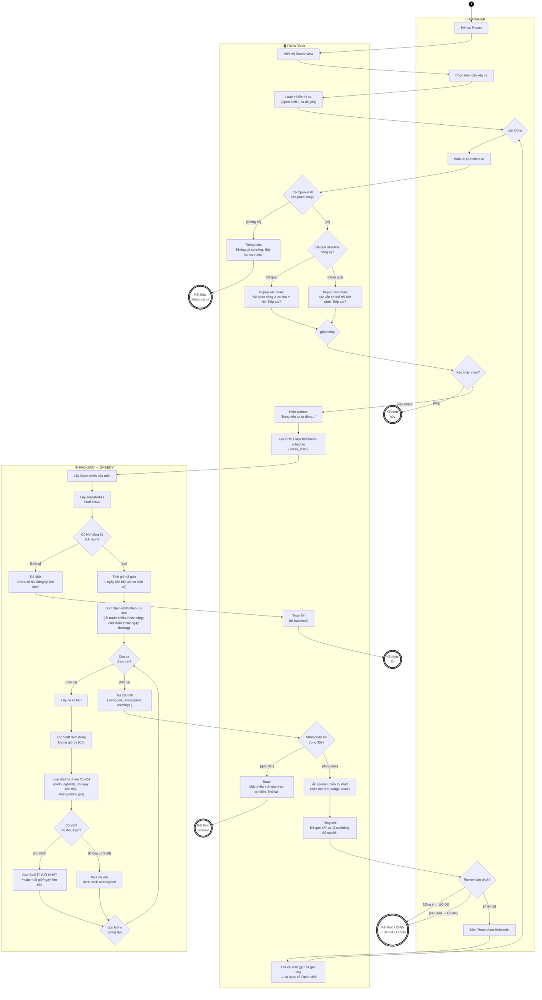

# AD-02 — Activity Diagram: Auto-Scheduling (Xếp ca tự động)

**Use Case**: UC-05 — Auto-Scheduling
**Actor chính**: Manager
**Partitions (swimlanes)**: Manager | Frontend | Backend (Greedy)
**Tham chiếu**: [UC-05-auto-schedule.md](../requirements/UC-05-auto-schedule.md)

> Tuân thủ ký pháp UML Activity Diagram: 1 **initial node** (●), nhiều **activity final** (◉),
> **action** (chữ nhật bo góc), **decision/merge** (◇), **guard** trong `[ngoặc vuông]`.
> Vòng lặp thuật toán greedy (`DB2 ↔ G2`) là phần lõi của sơ đồ. Không dùng fork/join — thuật toán xét **tuần tự** từng ca.

---

## Sơ đồ (Mermaid)



---

## Xuất hình cho báo cáo

### Cách 1 — mermaid.live (nhanh nhất, khuyên dùng)

1. Mở **https://mermaid.live** → dán nguyên Mermaid block → hình render bên phải.
2. **Actions → PNG** (hoặc SVG) → lưu vào `docs/diagrams/out/`.

### Cách 2 — VS Code

- Extension *Markdown Preview Mermaid Support* → mở file → **Preview** (Ctrl+Shift+V).

### Cách 3 — draw.io (nếu cần chỉnh shape thủ công)

> ⚠️ **KHÔNG** dùng *Extras → Edit Diagram…* (ô đó chỉ nhận XML → báo lỗi `Start tag expected`).

1. [draw.io](https://app.diagrams.net/) → toolbar **Insert (+) → Advanced → Mermaid…** → dán block → **Insert**.
2. (Tùy chọn) Tạo **3 swimlane ngang**: *Manager*, *Frontend*, *Backend (Greedy)*; kéo node vào đúng làn.
3. Map shape UML: `Start` = initial (●); `End1–5` = activity final (◉); `DF*/DM*/DB*` = decision (◇ có guard); `G1/G2/G3` = merge (◇ nhiều-vào/một-ra, không guard); còn lại = action.
4. Nên **đóng khung vùng vòng lặp** `DB2 → B5 → B6 → B7 → DB3 → B8/B9 → G2 → DB2` để nhấn mạnh đây là lõi thuật toán.

---

## Phân tích luồng

### Luồng chính (Happy path)

| Bước | Partition | Hành động |
|------|-----------|-----------|
| 1 | Manager | Mở Roster → chọn tuần |
| 2 | Frontend | Load ca (Open-shift + đã gán) |
| 3 | Manager | Bấm "Auto-Schedule" |
| 4 | Frontend | `DF1` có ca → `DF2` đã qua deadline → popup xác nhận |
| 5 | Manager | `DM1` xác nhận → spinner → POST /api/shifts/auto-schedule |
| 6 | Backend | Lấy open-shift, availabilities, tính giờ đã gán |
| 7 | Backend | Sort ca theo ưu tiên → **vòng lặp greedy** từng ca |
| 8 | Backend | Mỗi ca: lọc rảnh → lọc constraint → gán Staff ít giờ nhất (hoặc unassigned) |
| 9 | Backend | Trả `{ assigned, unassigned, warnings }` |
| 10 | Frontend | `DF3` đúng hạn → hiển thị draft + tổng kết |
| 11 | Manager | `DM2` review → Publish (UC-06) / Sửa tay (UC-04) / Chạy lại |

### Vòng lặp Greedy (lõi thuật toán)

```
SORT open_shifts theo ưu tiên (ca khó fill trước)
WHILE còn ca chưa xét:                    ← DB2
    shift = ca kế tiếp                     ← B5
    eligible = Staff rảnh đúng khung giờ   ← B6  (C5)
    eligible = loại Staff vi phạm C1–C4    ← B7
    IF eligible ≠ rỗng:                    ← DB3
        gán Staff ít giờ nhất + cập nhật   ← B8
    ELSE:
        đưa vào unassigned                 ← B9
RETURN { assigned, unassigned, warnings }  ← B10
```

| # | Constraint | Giá trị | Node |
|---|-----------|---------|------|
| C1 | Max giờ/tuần | 48h | B7 |
| C2 | Min nghỉ giữa 2 ca | 8h | B7 |
| C3 | Max ngày liên tiếp | 6 ngày | B7 |
| C4 | Không chồng giờ | — | B7 |
| C5 | Phải rảnh (đã đăng ký) | — | B6 |

### Luồng ngoại lệ

| Ngoại lệ | Node | Xử lý |
|-----------|------|-------|
| Không có Open-shift | `DF1[không có]` | Thông báo → **End1**, không chạy thuật toán |
| Chưa qua deadline | `DF2[chưa qua]` | Popup cảnh báo, Manager vẫn được tiếp tục |
| Manager hủy | `DM1[hủy]` | **End2** |
| Không có NV đăng ký lịch | `DB1[không]` | 400 → toast lỗi → **End3** |
| Một số ca không đủ người (5c) | `DB3[không có Staff]` | Ca vào `unassigned`, hiện trong tổng kết `F7` (không phải nhánh lỗi) |
| Timeout > 30s (5d) | `DF3[quá 30s]` | Toast → **End4** (Manager thử lại) |
| Reset & chạy lại (4b) | `DM2[chạy lại]` | Xóa ca auto, giữ ca gán tay → vòng về `G3 → MA3` |

### Điểm đúng chuẩn UML

- **Vòng lặp tuần tự** `DB2 ↔ G2`: thể hiện greedy xét **từng ca một**, không song song → đúng độ phức tạp `O(S×N)` mô tả trong UC-05.
- **Merge node** `G1` (gộp 2 nhánh popup), `G2` (gộp 2 kết quả gán/không-gán trong vòng lặp), `G3` (gộp luồng đầu vào + luồng reset chạy lại).
- **Guard `[…]`** trên mọi cạnh ra của decision; merge không có guard.
- **5c không phải lỗi**: ca không đủ người được gom vào `unassigned` và báo trong tổng kết — phân biệt rõ với nhánh ngoại lệ thực sự (End1–4).
- **Nhánh review** `DM2` dẫn sang UC-04 / UC-06 (chuyển use case) hoặc lặp reset — thể hiện đúng luồng phụ 4a/4b.

---

*Tài liệu phục vụ Chương 3.2 (Activity Diagram) và mô tả thuật toán (Chương 3.6) trong báo cáo đồ án.*
