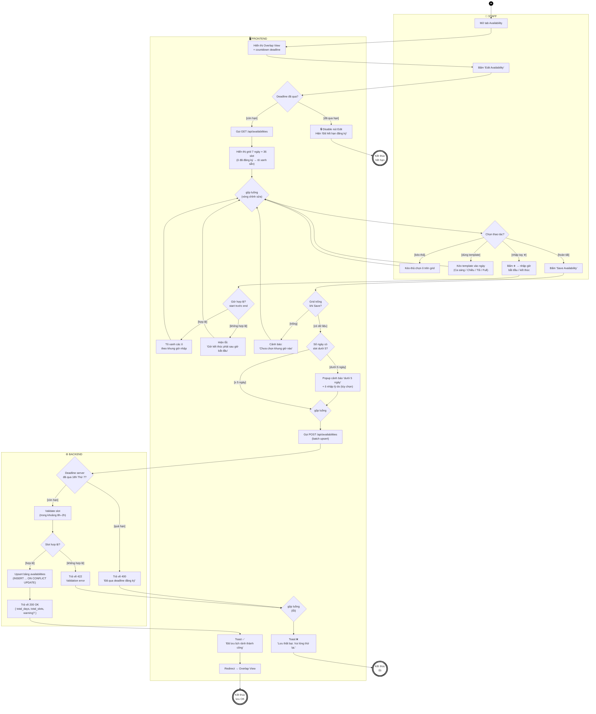

# AD-01 — Activity Diagram: Đăng ký lịch rảnh

**Use Case**: UC-02 — Đăng ký lịch rảnh hàng tuần
**Actor chính**: Staff
**Partitions (swimlanes)**: Staff | Frontend | Backend
**Tham chiếu**: [UC-02-availability.md](../requirements/UC-02-availability.md)

> Sơ đồ tuân thủ ký pháp UML Activity Diagram: 1 **initial node** (●), nhiều **activity final node** (◉),
> **action** (hình chữ nhật bo góc), **decision/merge node** (◇ hình thoi), **guard** trong `[ngoặc vuông]`.
> Không dùng fork/join vì luồng này **không có hoạt động song song thật sự** — 3 cách nhập liệu là *lựa chọn thay thế* trong một vòng lặp.

---

## Sơ đồ (Mermaid)

---

## Xuất hình cho báo cáo

### Cách 1 — mermaid.live (nhanh nhất, khuyên dùng)

1. Mở **https://mermaid.live** → dán nguyên Mermaid block vào ô bên trái.
2. Hình render ngay bên phải → **Actions → PNG** (hoặc SVG) để tải về `docs/diagrams/out/`.

### Cách 2 — VS Code

- Cài extension *Markdown Preview Mermaid Support* → mở file `.md` này → **Preview** (Ctrl+Shift+V).

### Cách 3 — draw.io (nếu cần chỉnh shape thủ công)

> ⚠️ **KHÔNG** dùng *Extras → Edit Diagram…* (ô đó chỉ nhận XML → báo lỗi `Start tag expected`).

1. Mở [draw.io](https://app.diagrams.net/) → toolbar **Insert (+) → Advanced → Mermaid…** → dán Mermaid block → **Insert**.
2. (Tùy chọn) Tạo **3 swimlane ngang** (Insert → Container → Horizontal Pool): *Staff*, *Frontend*, *Backend*; kéo node vào đúng làn.
3. Đổi shape theo ký pháp UML:
   - `Start` → **Initial node**: `ellipse;fillColor=#000000` (vòng tròn đặc).
   - `End1/End2/End3` → **Activity final**: vòng tròn viền dày có chấm giữa.
   - `D1…D7` → **Decision**: `rhombus` (hình thoi), có guard `[…]` trên cạnh ra.
   - `M1/M2/M3` → **Merge**: `rhombus` nhưng **nhiều-vào / một-ra, không có guard**.
   - Còn lại → **Action**: hình chữ nhật bo góc.
4. Export PNG/SVG → `docs/diagrams/out/`.

---

## Phân tích luồng

### Luồng chính (Happy path)

| Bước | Partition | Hành động |
|------|-----------|-----------|
| 1 | Staff | Mở tab Availability |
| 2 | Frontend | Hiển thị Overlap View + countdown |
| 3 | Staff | Bấm "Edit Availability" |
| 4 | Frontend | `D1` còn hạn → GET /api/availabilities → render grid |
| 5 | Staff | `M1→D2` chọn cách nhập (kéo-thả / template / ➕), lặp đến khi xong |
| 6 | Staff | `D2[hoàn tất]` → bấm Save |
| 7 | Frontend | `D4` có dữ liệu → `D5` ≥ 5 ngày → POST /api/availabilities |
| 8 | Backend | `D6` còn hạn → `D7` slot hợp lệ → upsert DB → 200 OK |
| 9 | Frontend | Toast thành công → redirect Overlap View → **End2** |

### Luồng ngoại lệ

| Ngoại lệ | Node | Xử lý |
|-----------|------|-------|
| Deadline đã qua (client) | `D1[đã qua hạn]` | Disable Edit → **End1** |
| Giờ nhập tay không hợp lệ | `D3[không hợp lệ]` | Hiện lỗi → quay lại vòng `M1` |
| Grid trống khi Save | `D4[trống]` | Cảnh báo → quay lại vòng `M1` |
| Đăng ký < 5 ngày | `D5[< 5 ngày]` | Popup + ô lý do → vẫn cho lưu (`M2`) |
| Deadline qua (server) | `D6[quá hạn]` | 400 → `M3` → toast lỗi → **End3** |
| Slot không hợp lệ (server) | `D7[không hợp lệ]` | 422 → `M3` → toast lỗi → **End3** |

### Điểm đúng chuẩn UML đã sửa so với bản cũ

| Vấn đề bản cũ | Sửa trong bản này |
|----------------|-------------------|
| Fork `&` cho 3 cách nhập (sai — không song song) | Thay bằng **decision `D2`** (lựa chọn thay thế) + vòng lặp qua **merge `M1`** |
| Luồng nhập lại không qua node gộp | Thêm **merge node `M1`, `M2`, `M3`** tường minh (nhiều-vào / một-ra) |
| Guard ghi "Có/Không" | Guard đúng ký pháp UML: `[còn hạn]`, `[< 5 ngày]`, `[hợp lệ]`… |
| Initial/Final node là stadium | `Start` = initial node (●), `End1–3` = activity final (◉) |

### Ghi chú thiết kế nghiệp vụ

- **Vòng lặp chỉnh sửa** (`M1`): Staff có thể phối hợp nhiều cách nhập trong một phiên, lặp đến khi bấm Save — phản ánh đúng FR-AVAIL-03/04/05.
- **Double-check deadline**: client (`D1`, disable UI) + server (`D6`, trả 400) — tránh race condition khi gần giờ chốt.
- **Upsert**: `ON CONFLICT UPDATE` cho phép Save nhiều lần, ghi đè lần trước (FR-AVAIL-06).
- **Cảnh báo < 5 ngày** là *warning, không block* — Manager xem được lý do khi duyệt (FR-AVAIL-07).

---

*Tài liệu phục vụ Chương 3.2 (Activity Diagram) trong báo cáo đồ án.*
