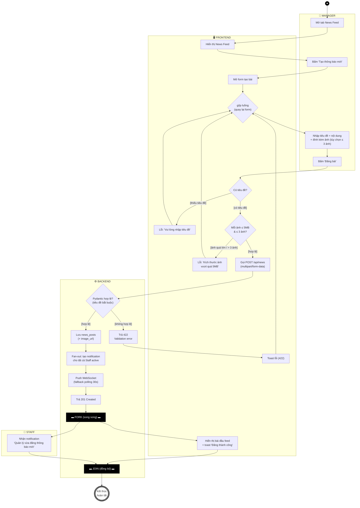

# AD-04 — Activity Diagram: Tạo tin thông báo nội bộ

**Use Case**: UC-11 — Tạo thông báo nội bộ (FR-NEWS-01 + FR-NOTIF-05)
**Actor chính**: Manager (Staff nhận notification)
**Partitions (swimlanes)**: Manager | Frontend | Backend | Staff
**Tham chiếu**: [module-news.md](../requirements/module-news.md), [UC-03-to-14.md](../requirements/UC-03-to-14.md)

> Tuân thủ ký pháp UML Activity Diagram: 1 **initial node** (●), **activity final** (◉),
> **action** (chữ nhật bo góc), **decision/merge** (◇), **fork/join** (thanh đồng bộ ▬), **guard** trong `[ngoặc vuông]`.
> Khác 3 sơ đồ trước: ở đây có **concurrency thật** — sau khi đăng bài, *Frontend hiển thị feed* và *Staff nhận notification* diễn ra **song song** → dùng **fork/join**.

---

## Sơ đồ (Mermaid)

---

## Xuất hình cho báo cáo

### Cách 1 — mermaid.live (nhanh nhất, khuyên dùng)

1. Mở **https://mermaid.live** → dán nguyên Mermaid block → hình render bên phải.
2. **Actions → PNG** (hoặc SVG) → lưu vào `docs/diagrams/out/`.

### Cách 2 — VS Code

- Extension *Markdown Preview Mermaid Support* → mở file → **Preview** (Ctrl+Shift+V).

### Cách 3 — draw.io (nếu cần chỉnh shape thủ công)

> ⚠️ **KHÔNG** dùng *Extras → Edit Diagram…* (ô đó chỉ nhận XML → báo lỗi `Start tag expected`).

1. [draw.io](https://app.diagrams.net/) → toolbar **Insert (+) → Advanced → Mermaid…** → dán block → **Insert**.
2. (Tùy chọn) Tạo **4 swimlane ngang**: *Manager*, *Frontend*, *Backend*, *Staff*; kéo node vào đúng làn.
3. Map shape UML: `Start` = initial (●); `EndDone` = activity final (◉); `DF*/DB1` = decision (◇ có guard); `GE` = merge (◇); `FK/JN` = **thanh fork/join** (`shape=line;...` đậm); còn lại = action.

---

## Phân tích luồng

### Luồng chính (Happy path)

| Bước | Partition | Hành động |
|------|-----------|-----------|
| 1 | Manager | Mở News Feed → "Tạo thông báo mới" |
| 2 | Frontend | Mở form |
| 3 | Manager | Nhập tiêu đề + nội dung + ảnh → "Đăng bài" |
| 4 | Frontend | `DF1` có tiêu đề → `DF2` ảnh hợp lệ → POST /api/news |
| 5 | Backend | `DB1` hợp lệ → lưu `news_posts` |
| 6 | Backend | Fan-out notification cho tất cả Staff → push WebSocket → 201 |
| 7 | (song song) | **Frontend** hiển thị bài đầu feed ∥ **Staff** nhận notification |
| 8 | Backend | `JOIN` đồng bộ → **EndDone** |

### Luồng ngoại lệ

| Ngoại lệ | Node | Xử lý |
|-----------|------|-------|
| Thiếu tiêu đề | `DF1[thiếu tiêu đề]` | Lỗi inline → quay lại form (`GE`) |
| Ảnh > 5MB hoặc > 3 ảnh | `DF2[ảnh quá lớn]` | Lỗi → quay lại form (`GE`) |
| Backend reject (422) | `DB1[không hợp lệ]` | Toast lỗi → quay lại form (`GE`) |

### Điểm đúng chuẩn UML

- **Fork/Join đúng ngữ cảnh**: `FK → {F4 ∥ ST1} → JN`. Sau khi 201 trả về, **hai luồng độc lập chạy song song** (Manager thấy feed + Staff nhận notification), rồi **join** đồng bộ trước khi kết thúc. Đây là concurrency *thật* — khác với 3 sơ đồ trước (tuần tự, không fork).
- **Merge `GE`**: gom 3 nhánh lỗi (thiếu tiêu đề / ảnh lớn / 422) quay về form để Manager sửa và đăng lại.
- **Double validation**: client (`DF1`, `DF2`) + server (`DB1`) — đúng NFR-REL-02 (mọi POST có Pydantic schema, thiếu field → 422).
- **Fan-out notification** (`B2`) mô hình hóa thành **một action** rồi fork sang lane Staff — tránh vẽ N nhánh cho N nhân viên.

### Ghi chú nghiệp vụ

- **FR-NOTIF-05**: tạo bài bắt buộc kéo theo notification cho toàn bộ Staff (`B2`).
- **FR-NOTIF-06**: ưu tiên WebSocket, fallback polling 30s (`B3`) — Should Have.
- **BR-NW-04**: ảnh tối đa 5MB/ảnh, tối đa 3 ảnh/bài (`DF2`).

---

*Tài liệu phục vụ Chương 3.2 (Activity Diagram) trong báo cáo đồ án.*
