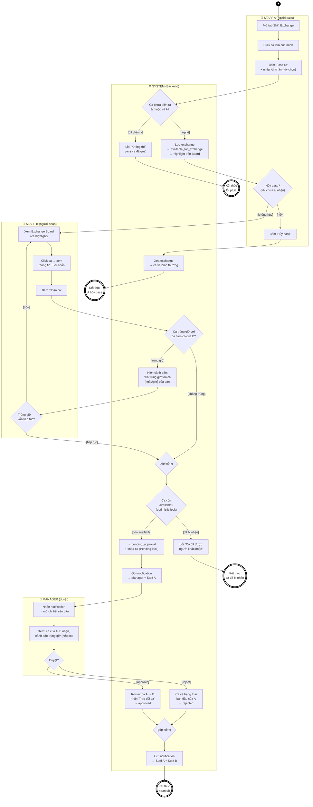

# AD-03 — Activity Diagram: Pass ca / Nhận ca

**Use Case**: UC-08 (Pass ca) + UC-09 (Nhận ca) + UC-10 (Duyệt trao đổi ca)
**Actor**: Staff A (người pass) · Staff B (người nhận) · Manager (duyệt)
**Partitions (swimlanes)**: Staff A | Staff B | System (Backend) | Manager
**Phạm vi**: **Version 1** — chỉ Pass + Nhận ca. *Swap ca (đổi 2 chiều) thuộc Version 2.*
**Tham chiếu**: [module-exchange.md](../requirements/module-exchange.md), [UC-03-to-14.md](../requirements/UC-03-to-14.md)

> Tuân thủ ký pháp UML Activity Diagram: 1 **initial node** (●), nhiều **activity final** (◉),
> **action** (chữ nhật bo góc), **decision/merge** (◇), **guard** trong `[ngoặc vuông]`.
> Đây là luồng **đa actor** nên mỗi actor là một partition; không dùng fork/join vì các bước diễn ra **tuần tự** (A → B → Manager).

---

## Sơ đồ (Mermaid)

---

## Xuất hình cho báo cáo

### Cách 1 — mermaid.live (nhanh nhất, khuyên dùng)

1. Mở **https://mermaid.live** → dán nguyên Mermaid block → hình render bên phải.
2. **Actions → PNG** (hoặc SVG) → lưu vào `docs/diagrams/out/`.

### Cách 2 — VS Code

- Extension *Markdown Preview Mermaid Support* → mở file → **Preview** (Ctrl+Shift+V).

### Cách 3 — draw.io (nếu cần chỉnh shape thủ công)

> ⚠️ **KHÔNG** dùng *Extras → Edit Diagram…* (ô đó chỉ nhận XML → báo lỗi `Start tag expected`).

1. [draw.io](https://app.diagrams.net/) → toolbar **Insert (+) → Advanced → Mermaid…** → dán block → **Insert**.
2. (Tùy chọn) Tạo **4 swimlane ngang**: *Staff A*, *Staff B*, *System*, *Manager*; kéo node vào đúng làn.
3. Map shape UML: `Start` = initial (●); `End*` = activity final (◉); `DA*/DB*/DL*/DM*/DBO/DBC` = decision (◇ có guard); `GT/GN` = merge (◇ nhiều-vào/một-ra, không guard); còn lại = action.

---

## Phân tích luồng

### Luồng chính (Happy path)

| Bước | Partition | Hành động | UC |
|------|-----------|-----------|-----|
| 1 | Staff A | Mở Shift Exchange → click ca của mình → "Pass ca" + lời nhắn | UC-08 |
| 2 | System | `DA1` hợp lệ → lưu exchange `available_for_exchange`, highlight Board | UC-08 |
| 3 | Staff B | Xem Board → click ca → "Nhận ca" | UC-09 |
| 4 | System | `DBO` không trùng → `DLK` còn available → `pending_approval` + khóa | UC-09 |
| 5 | System | Notification → Manager + Staff A | UC-09 |
| 6 | Manager | Mở chi tiết → `DMG` Approve | UC-10 |
| 7 | System | Roster: ca A → B, nhãn "Trao đổi ca", `approved` | UC-10 |
| 8 | System | Notification → A + B → **EndDone** | UC-10 |

### Luồng ngoại lệ

| Ngoại lệ | Node | Xử lý |
|-----------|------|-------|
| Pass ca đã diễn ra | `DA1[đã diễn ra]` | Lỗi → **EndErr1** |
| Staff A hủy pass (chưa ai nhận) | `DA2[hủy]` | Xóa exchange, ca về bình thường → **EndCancel** |
| Ca nhận trùng giờ ca của B | `DBO[trùng giờ]` → `DBC` | Cảnh báo; B `[hủy]` quay về Board / `[tiếp tục]` đi tiếp (Manager thấy cảnh báo khi duyệt) |
| Nhiều người cùng nhận | `DLK[đã bị nhận]` | Optimistic lock: chỉ 1 thành công, người sau báo lỗi → **EndErr2** |
| Manager từ chối | `DMG[reject]` | Ca về trạng thái ban đầu của A, `rejected` → notif → **EndDone** |

### Điểm đúng chuẩn UML

- **Đa actor = đa partition**: Staff A, Staff B, Manager tách lane riêng; System gom toàn bộ backend (validate, lock, cập nhật Roster, notification).
- **Tuần tự, không fork/join**: quy trình đi theo thứ tự A → B → Manager, không có nhánh chạy song song.
- **Merge node** `GT` (gộp 2 nhánh trùng/không-trùng giờ trước khi commit), `GN` (gộp approve/reject trước khi gửi notification chung).
- **Vòng lặp** `DBC[hủy] → SB1`: B từ chối tiếp tục khi trùng giờ thì quay lại Board chọn ca khác.
- **Guard `[…]`** đầy đủ; merge không guard.

### Ghi chú nghiệp vụ (Business Rules liên quan)

- **BR-EX-02 (Optimistic lock)** thể hiện ở `DLK` — đúng NFR-REL-04: 5 request đồng thời → chỉ 1 thành công.
- **BR-EX-03 (không tự nhận ca mình)**: UI không hiển thị nút "Nhận ca" cho chính người đăng (chủ ca chỉ thấy trạng thái pass), nên không cần nhánh riêng trong sơ đồ.
- **BR-EX-05 (cảnh báo trùng giờ)**: `DBO → SYW` — cho phép tiếp tục nhưng đánh dấu để Manager xem khi duyệt.
- **BR-EX-04 (cập nhật Roster 1 chiều)**: `SY5` — Pass chỉ chuyển ca A → B (Swap 2 chiều thuộc Version 2).

---

*Tài liệu phục vụ Chương 3.2 (Activity Diagram) trong báo cáo đồ án.*
