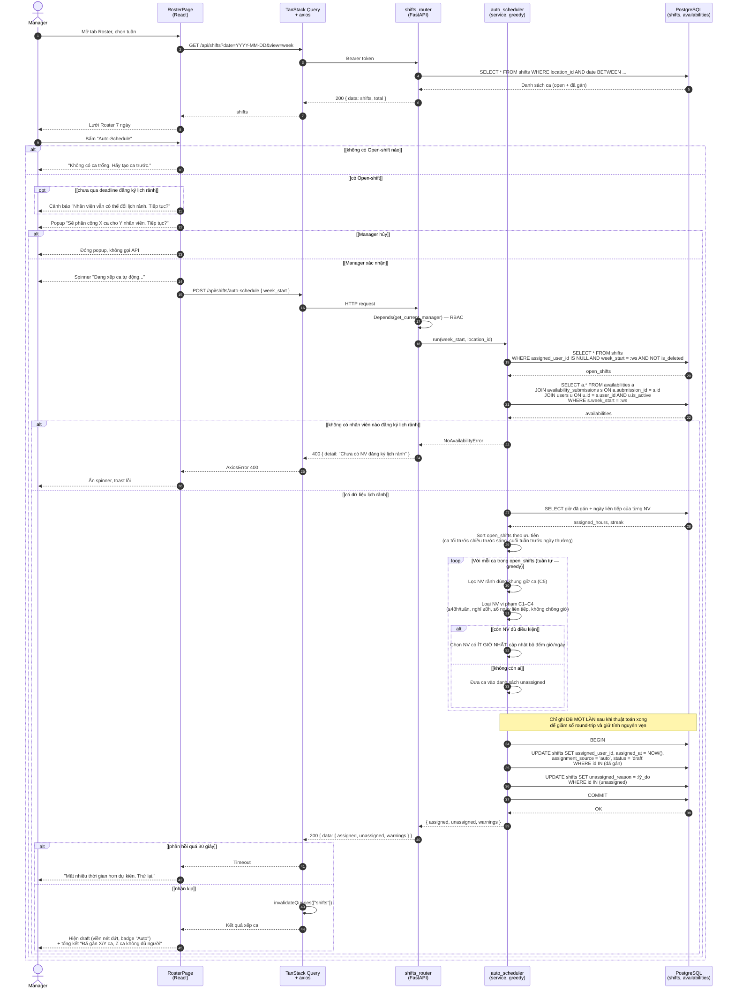
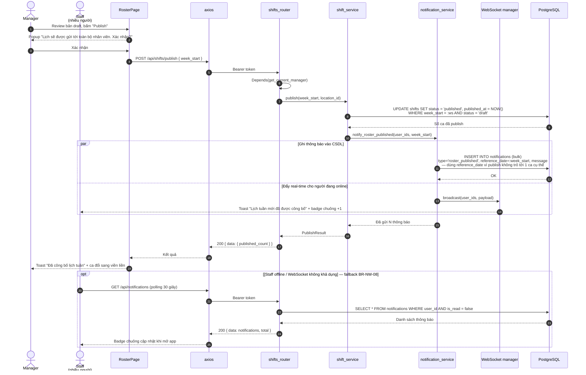

# SD-03 — Sequence Diagram: Auto-Schedule + Publish lịch

**Use Case**: UC-05 (Auto-Scheduling) + UC-06 (Publish Roster)
**Actor chính**: Manager · **Actor phụ**: Staff (nhận thông báo)
**Tham chiếu**: [UC-05-auto-schedule.md](../requirements/UC-05-auto-schedule.md) · [module-roster.md](../requirements/module-roster.md) · [activity-auto-schedule.md](activity-auto-schedule.md)

> Ký pháp UML: `loop` cho vòng lặp greedy, `alt/else` + guard `[...]` cho nhánh rẽ,
> `par` cho các message **xảy ra song song** (fan-out thông báo), `-->>` cho return message.
> Sơ đồ này là góc nhìn **tương tác giữa các đối tượng** của cùng thuật toán đã mô tả
> bằng Activity Diagram AD-02 — hai sơ đồ bổ sung cho nhau, không thay thế nhau.

---

## 1. Sơ đồ chính — Auto-Schedule (Mermaid)



---

## 2. Sơ đồ phụ — Publish lịch + fan-out thông báo (UC-06)



---

## 3. Ánh xạ lifeline sang tầng kiến trúc

| Lifeline | Thành phần thực tế | Vị trí mã nguồn (dự kiến) |
|----------|--------------------|---------------------------|
| `PG` | Trang Roster + lưới ca | `frontend/src/pages/RosterPage.tsx` |
| `RT` | FastAPI router | `backend/app/api/shifts.py` |
| `AS` | Thuật toán greedy xếp ca | `backend/app/services/auto_scheduler.py` |
| `SV` | Nghiệp vụ ca làm (tạo/sửa/publish) | `backend/app/services/shift_service.py` |
| `NS` | Sinh + phát thông báo | `backend/app/services/notification_service.py` |
| `WS` | Quản lý kết nối WebSocket theo user | `backend/app/api/notifications.py` (WebSocket endpoint) |

---

## 4. Phân tích luồng

### Luồng chính (Happy path)

| Bước | Message | Ghi chú |
|------|---------|---------|
| 1–8 | Load Roster tuần | Index `shifts(location_id, date)` |
| 9–14 | Kiểm tra tiền điều kiện ở client + xác nhận | Tránh gọi API vô ích |
| 15–20 | `POST /api/shifts/auto-schedule`, nạp dữ liệu | 3 truy vấn đọc, nạp một lần vào bộ nhớ |
| 21–22 | Tính giờ đã gán + sắp xếp ca theo độ khó | Ca khó fill được xét trước |
| 23–28 | Vòng `loop` greedy | Độ phức tạp `O(S x N)` — S số ca, N số nhân viên |
| 29–33 | Ghi kết quả trong 1 transaction | Ca được gán chuyển sang `draft` |
| 34–39 | Trả kết quả, invalidate cache, hiện draft | Manager review trước khi publish |

### Vòng lặp Greedy (lõi thuật toán)

```
SORT open_shifts theo ưu tiên (ca khó fill trước)
FOR shift IN open_shifts:                       ← loop
    eligible = NV rảnh đúng khung giờ            ← C5
    eligible = loại NV vi phạm C1–C4
    IF eligible khác rỗng:
        gán NV ít giờ nhất, cập nhật bộ đếm
    ELSE:
        đưa shift vào unassigned
RETURN { assigned, unassigned, warnings }
```

| # | Constraint | Giá trị |
|---|-----------|---------|
| C1 | Số giờ tối đa mỗi tuần | 48h |
| C2 | Nghỉ tối thiểu giữa 2 ca | 8h |
| C3 | Số ngày liên tiếp tối đa | 6 ngày |
| C4 | Không chồng giờ | — |
| C5 | Phải đã đăng ký rảnh khung giờ đó | — |

### Luồng ngoại lệ

| Ngoại lệ | Fragment | Xử lý |
|----------|----------|-------|
| Không có Open-shift | `alt` ngoài cùng | Thông báo ở client, không gọi API |
| Chưa qua deadline đăng ký | `opt` | Cảnh báo nhưng vẫn cho chạy |
| Manager hủy ở popup | `alt [Manager hủy]` | Kết thúc, không gọi API |
| Không ai đăng ký lịch rảnh | `alt [không có nhân viên...]` | 400, toast lỗi |
| Một số ca không đủ người | `alt [không còn ai]` trong `loop` | Gom vào `unassigned` — **không phải lỗi**, báo trong tổng kết |
| Timeout > 30s | `alt [phản hồi quá 30 giây]` | Toast, Manager thử lại |
| Staff offline khi publish | `opt` ở sơ đồ mục 2 | Fallback polling 30s (BR-NW-08) |

### Điểm đúng chuẩn UML

- Toàn bộ thuật toán greedy nằm trong các **self-message** của `AS` (`AS->>AS`), thể hiện đây là tính toán **trong bộ nhớ**, không phải một chuỗi truy vấn CSDL trong vòng lặp — đây chính là lý do tránh được vấn đề N+1 query.
- Message ghi CSDL được đặt **sau** khối `loop` kèm Note giải thích, cho thấy quyết định thiết kế "tính xong mới ghi một lần".
- Fragment `par` ở sơ đồ mục 2 diễn tả đúng ngữ nghĩa fork/join của Activity Diagram AD-04: lưu thông báo vào CSDL và đẩy WebSocket là **hai việc song song**, không phụ thuộc nhau.
- Lifeline `S` (Staff) trong sơ đồ mục 2 **không do Manager gọi trực tiếp** mà nhận message từ `WS` — thể hiện đúng bản chất push của WebSocket.
- Nhánh `opt` polling ở cuối cho thấy cơ chế graceful degradation (NFR-REL-05) mà vẫn giữ cùng một API `GET /api/notifications`.

---

## 5. Xuất hình cho báo cáo

Xem [README.md](README.md). Sơ đồ mục 1 khá dài — nên export **SVG**, hoặc khi chèn vào Word thì đặt ở **trang ngang (landscape)** cho dễ đọc.

---

*Tài liệu phục vụ Chương 3.4 (Sequence Diagram) và mô tả thuật toán (Chương 3.6) trong báo cáo đồ án.*
