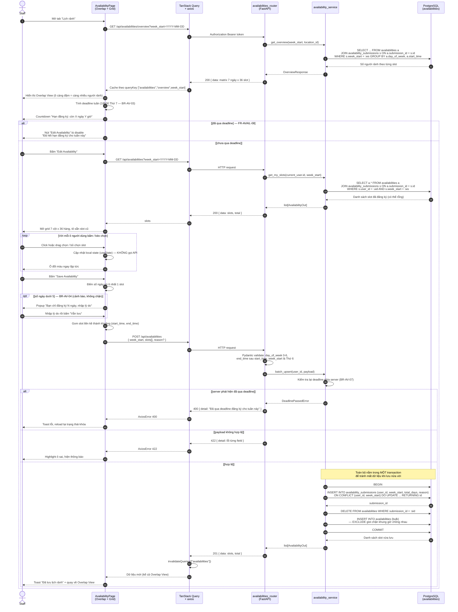
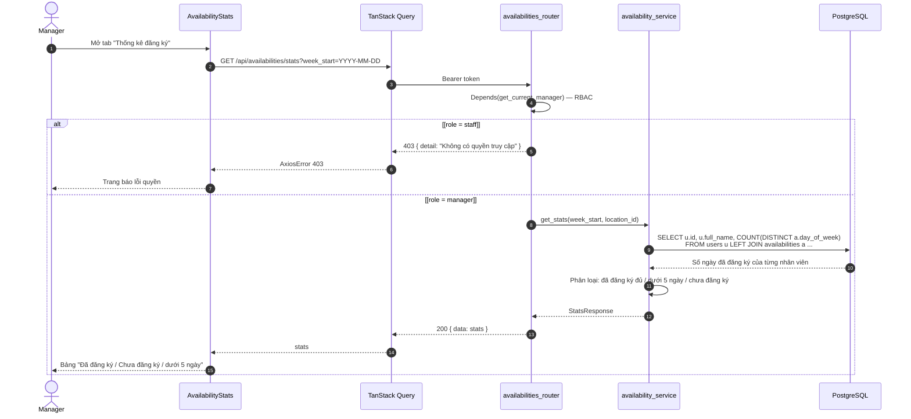

# SD-02 — Sequence Diagram: Đăng ký lịch rảnh (Availability Grid)

**Use Case**: UC-02 — Đăng ký lịch rảnh
**Actor chính**: Staff (Manager cũng dùng được — BR-AV-06)
**Tham chiếu**: [UC-02-availability.md](../requirements/UC-02-availability.md) · [module-availability.md](../requirements/module-availability.md) · [activity-availability.md](activity-availability.md)

> Ký pháp UML: **lifeline**, `->>` synchronous message, `-->>` return message,
> `alt/else` + **guard** `[...]` cho nhánh rẽ, `loop` cho hành vi lặp, `opt` cho fragment tùy chọn.
> Điểm nhấn của sơ đồ: **thao tác chọn slot diễn ra hoàn toàn ở client** (không gọi API từng ô),
> chỉ khi bấm Save mới gửi **một** request batch upsert duy nhất.

---

## 1. Sơ đồ chính (Mermaid)

---

## 2. Sơ đồ phụ — Manager theo dõi tình hình đăng ký (FR-AVAIL-11)

---

## 3. Ánh xạ lifeline sang tầng kiến trúc

| Lifeline | Thành phần thực tế | Vị trí mã nguồn (dự kiến) |
|----------|--------------------|---------------------------|
| `PG` | Page + grid component | `frontend/src/pages/AvailabilityPage.tsx`, `components/AvailabilityGrid.tsx` |
| `Q` | Custom hook bọc TanStack Query + axios | `frontend/src/hooks/useAvailabilities.ts`, `services/availability.service.ts` |
| `RT` | FastAPI router | `backend/app/api/availabilities.py` |
| `SV` | Business logic: deadline, batch upsert, thống kê | `backend/app/services/availability_service.py` |
| `DB` | Bảng `availabilities` | `backend/app/models/availability.py` |

---

## 4. Phân tích luồng

### Luồng chính (Happy path)

| Bước | Message | Ghi chú |
|------|---------|---------|
| 1–9 | Load Overlap View | 1 query GROUP BY, không N+1 |
| 10–11 | Tính + hiển thị countdown deadline | FR-AVAIL-13, tính ở client theo BR-AV-03 |
| 13–21 | Mở grid, load slot cũ | Cho phép sửa thay vì nhập lại từ đầu |
| 22–24 | Vòng `loop` chọn slot | **Chỉ đổi local state** — điểm quan trọng về hiệu năng |
| 25–29 | Gom slot + gửi 1 request batch | Giảm 36×7 request tiềm năng xuống còn 1 |
| 30–40 | Validate 2 lớp, upsert trong transaction | Upsert `availability_submissions` (UNIQUE `user_id, week_start` enforce BR-AV-05) rồi delete-then-insert các khung giờ con; `reason` lưu ở bảng submission theo FR-AVAIL-07 |
| 41–43 | Invalidate cache | Overlap View tự cập nhật, không cần reload trang |

### Luồng ngoại lệ

| Ngoại lệ | Fragment | Xử lý |
|----------|----------|-------|
| Đã qua deadline khi mở trang | `alt [đã qua deadline]` | Disable nút Edit ngay ở UI |
| Deadline trôi qua **trong lúc** đang chỉnh sửa | `alt [server phát hiện...]` | Server trả 400 — UI không phải nguồn tin cậy duy nhất (BR-AV-07) |
| Đăng ký dưới 5 ngày | `opt [số ngày dưới 5]` | Cảnh báo + nhập lý do, **vẫn cho lưu** (BR-AV-04) |
| Payload sai định dạng | `alt [payload không hợp lệ]` | 422 kèm chi tiết từng field |
| Staff gọi API thống kê | Sơ đồ mục 2, nhánh 403 | `Depends(get_current_manager)` |

### Điểm đúng chuẩn UML

- Fragment `loop` bao quanh thao tác chọn ô, kèm message **tự gọi chính mình** (`PG->>PG`) — thể hiện rõ đây là xử lý nội bộ client, hoàn toàn không có message nào chạy sang backend trong vòng lặp.
- Hai lớp validate (Pydantic ở `RT`, nghiệp vụ ở `SV`) được vẽ thành **hai message riêng** thay vì gộp, phản ánh đúng nguyên tắc "router chỉ validate cấu trúc, service kiểm tra nghiệp vụ".
- **Note** đặt ngang `SV`–`DB` để khoanh vùng transaction — thứ mà bản thân chuỗi message không diễn tả được.
- Nhánh kiểm tra deadline xuất hiện **hai lần** (client và server) là có chủ ý, thể hiện nguyên tắc *never trust the client*.
- Việc `Q` (TanStack Query) là một lifeline độc lập cho thấy tầng cache nằm giữa UI và HTTP — giải thích được vì sao Overlap View tự làm mới sau khi lưu.

---

## 5. Xuất hình cho báo cáo

Xem [README.md](README.md). Khuyến nghị export **SVG** cho sơ đồ mục 1 (khá dài, PNG dễ mờ khi co vào Word).

---

*Tài liệu phục vụ Chương 3.4 (Sequence Diagram) trong báo cáo đồ án.*
