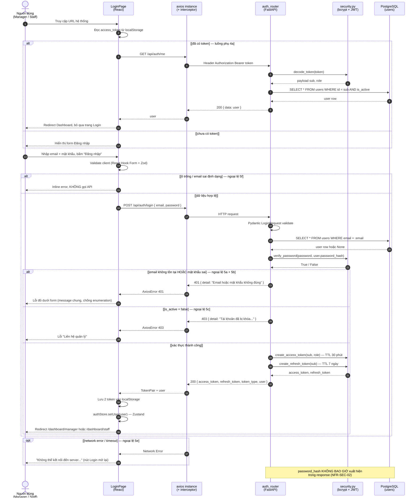
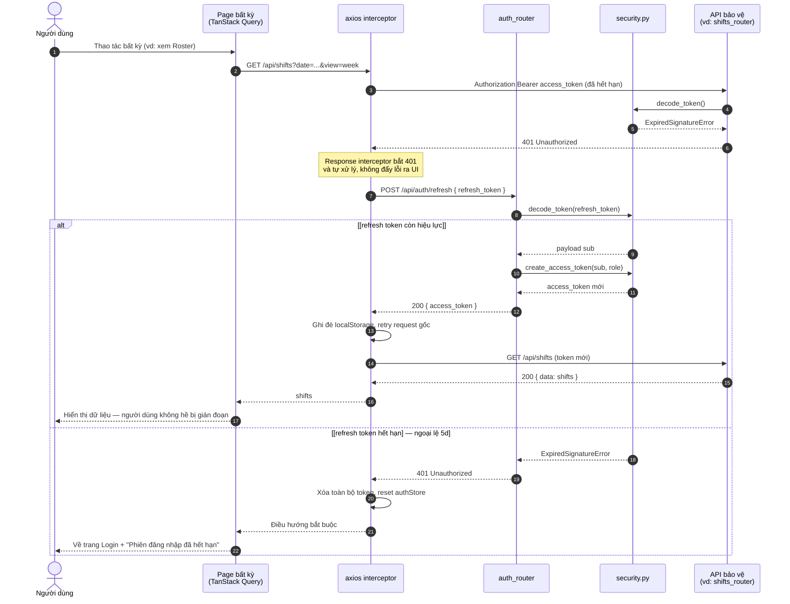
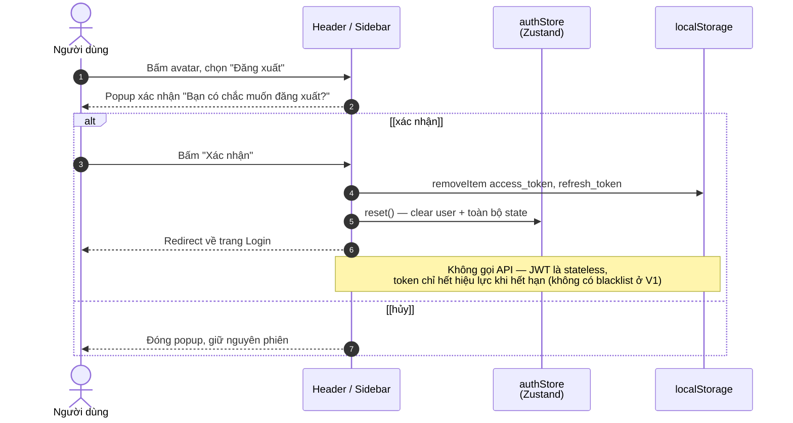

# SD-01 — Sequence Diagram: Đăng nhập / Refresh Token / Đăng xuất

**Use Case**: UC-01 — Đăng nhập / Đăng xuất
**Actor chính**: Manager, Staff
**Tham chiếu**: [UC-01-auth.md](../requirements/UC-01-auth.md) · [module-auth.md](../requirements/module-auth.md)

> Tuân thủ ký pháp UML Sequence Diagram: **lifeline** cho từng đối tượng, mũi tên liền `->>` là
> **synchronous message**, mũi tên nét đứt `-->>` là **return message**, khối `alt/else` là
> **combined fragment** với **guard** trong `[ngoặc vuông]`, `opt` là fragment tùy chọn.
> Thứ tự thời gian đọc từ **trên xuống dưới**.

---

## 1. Sơ đồ chính — Đăng nhập (Mermaid)

---

## 2. Sơ đồ phụ — Tự động refresh Access Token (luồng phụ 4b)

---

## 3. Sơ đồ phụ — Đăng xuất

---

## 4. Ánh xạ lifeline sang tầng kiến trúc

| Lifeline | Thành phần thực tế | Vị trí mã nguồn (dự kiến) |
|----------|--------------------|---------------------------|
| `FE` | React page + component | `frontend/src/pages/LoginPage.tsx` |
| `AX` | Axios instance + request/response interceptor | `frontend/src/lib/axios.ts` |
| `ST` | Zustand store lưu user hiện tại | `frontend/src/stores/authStore.ts` |
| `RT` | FastAPI router (`APIRouter`) | `backend/app/api/auth.py` |
| `SEC` | Hàm băm mật khẩu + tạo/verify JWT | `backend/app/core/security.py` |
| `DB` | SQLAlchemy async session → PostgreSQL | `backend/app/models/user.py` |

---

## 5. Phân tích luồng

### Luồng chính (Happy path)

| Bước | Message | Ghi chú |
|------|---------|---------|
| 1–2 | Truy cập URL, đọc localStorage | Route Guard phía FE (FR-AUTH-13) |
| 3–5 | Nhập thông tin, validate client | Chặn request rác lên server |
| 6–9 | `POST /api/auth/login`, tra cứu user | Index `UNIQUE(email)` giúp truy vấn nhanh |
| 10 | `verify_password()` bằng bcrypt | Cost factor ≥ 12 |
| 11–12 | Sinh cặp access + refresh token | HS256, TTL 30 phút / 7 ngày |
| 13–15 | Lưu token, set store, redirect theo role | Manager và Staff vào 2 dashboard khác nhau |

### Luồng ngoại lệ

| Ngoại lệ | Fragment | Xử lý |
|----------|----------|-------|
| Validation client (5f) | `alt [ô trống...]` | Inline error, không gọi API |
| Email sai / mật khẩu sai (5a, 5b) | `alt` nhánh 1 | Trả **cùng một** message 401 — chống enumeration attack |
| Tài khoản bị khóa (5c) | `alt` nhánh 2 | 403, gợi ý liên hệ quản lý |
| Lỗi mạng (5e) | `opt` | Toast, mở lại nút Đăng nhập |
| Access token hết hạn (4b) | Sơ đồ mục 2 | Interceptor tự refresh + retry, người dùng không thấy gì |
| Refresh token hết hạn (5d) | Sơ đồ mục 2, nhánh 2 | Xóa token, về Login |

### Điểm đúng chuẩn UML

- Mỗi lifeline là **một đối tượng có trách nhiệm riêng** (UI / HTTP client / router / service bảo mật / CSDL) — thể hiện đúng kiến trúc phân lớp, không gộp "Hệ thống" thành một khối chung.
- **Return message** (`-->>`) luôn đi kèm mã HTTP và payload, giúp đối chiếu trực tiếp với đặc tả API.
- Ba **combined fragment** lồng nhau (`alt` token → `alt` validate → `alt` xác thực) mô tả đủ 6 luồng ngoại lệ của UC-01 mà không cần vẽ thêm sơ đồ rời.
- **Note** dùng để ghi ràng buộc phi chức năng (NFR-SEC-02, JWT stateless) — thông tin không thể hiện được bằng message.
- Cơ chế refresh token được tách thành sơ đồ riêng vì nó là **luồng do interceptor tự khởi tạo**, không do actor kích hoạt.

---

## 6. Xuất hình cho báo cáo

Xem hướng dẫn chung ở [README.md](README.md). Tóm tắt:

1. **mermaid.live** (khuyên dùng): dán từng Mermaid block → *Actions → PNG* → lưu `out/sequence-login-1.png`, `-2.png`, `-3.png`.
2. **VS Code**: extension *Markdown Preview Mermaid Support* → Ctrl+Shift+V.
3. **draw.io**: Insert (+) → Advanced → Mermaid… (KHÔNG dùng *Edit Diagram* — ô đó chỉ nhận XML).

> Với sequence diagram nên export **SVG** rồi chèn vào Word, vì hình khá rộng, PNG dễ bị mờ khi co lại.

---

*Tài liệu phục vụ Chương 3.4 (Sequence Diagram) trong báo cáo đồ án.*
