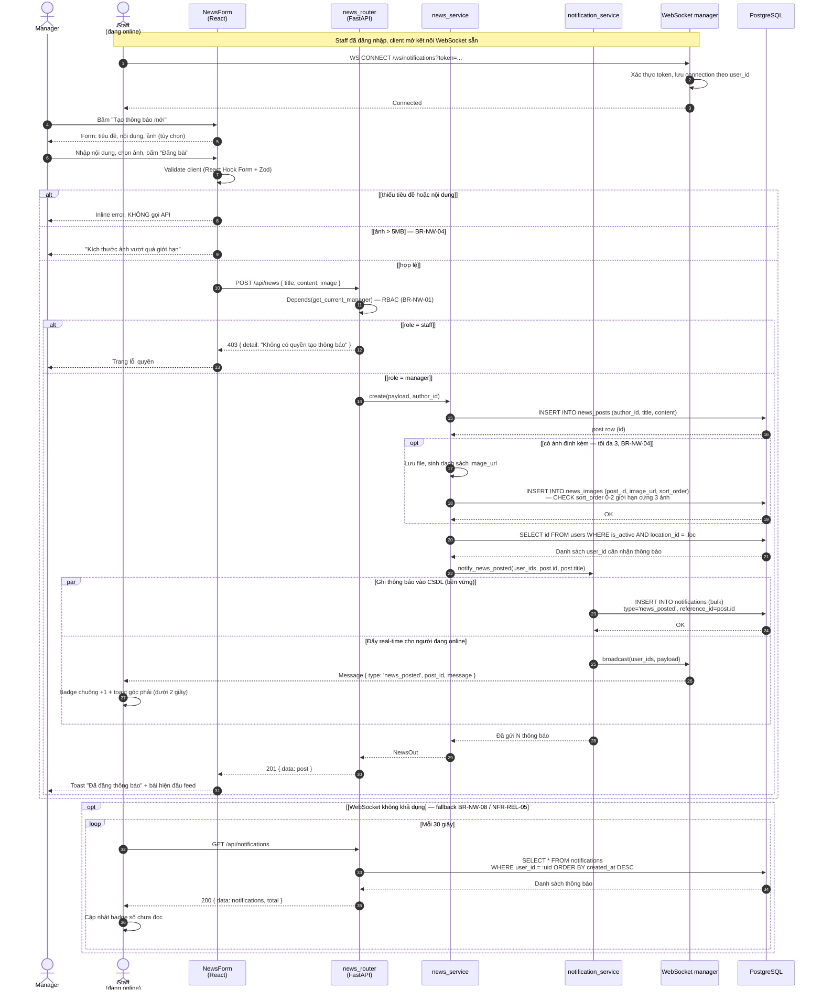
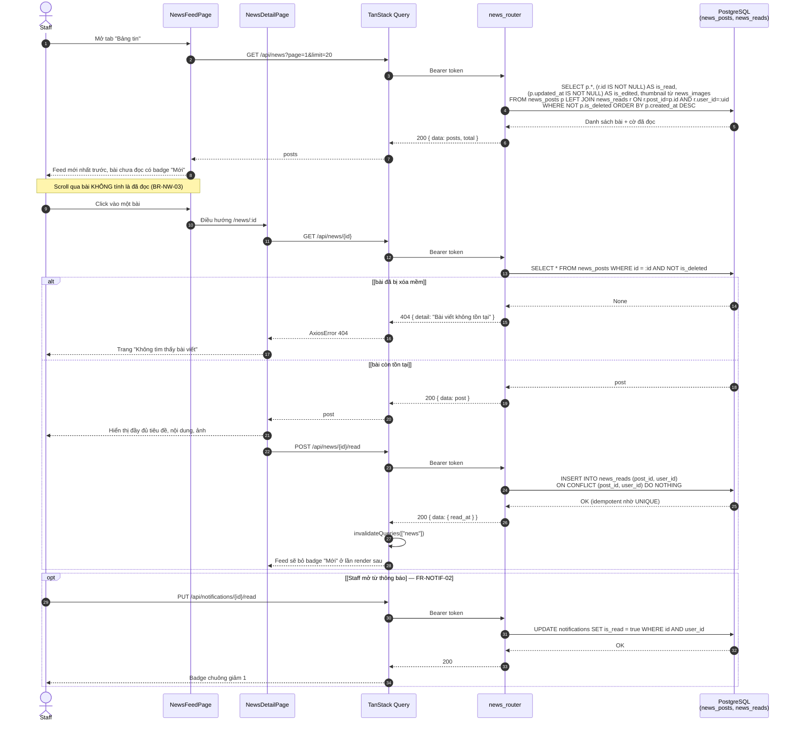
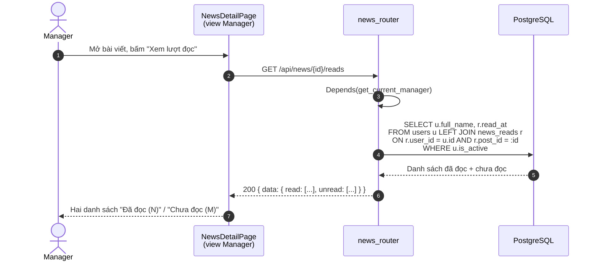

# SD-05 — Sequence Diagram: Đăng thông báo nội bộ + Notification real-time

**Use Case**: UC-11 (Tạo bài thông báo) + UC-12 (Xem News Feed / Seen tracking) + FR-NOTIF-06
**Actor**: Manager (đăng bài) · Staff (đọc bài, nhận thông báo)
**Tham chiếu**: [module-news.md](../requirements/module-news.md) · [activity-news-post.md](activity-news-post.md)

> Ký pháp UML: `par` cho fan-out **song song** (ghi CSDL + push WebSocket),
> `alt/else` + guard `[...]`, `opt` cho fragment tùy chọn, `loop` cho polling fallback.
> Điểm nhấn: cơ chế **WebSocket push + fallback polling 30s** (BR-NW-08, NFR-REL-05)
> và **Seen tracking** chỉ ghi nhận khi Staff mở chi tiết bài (BR-NW-03).

---

## 1. Sơ đồ chính — Manager đăng bài + Staff nhận thông báo (Mermaid)

---

## 2. Sơ đồ phụ — Staff đọc bài + Seen tracking (UC-12, BR-NW-03)

---

## 3. Sơ đồ phụ — Manager xem ai đã đọc (FR-NEWS-06)

---

## 4. Ánh xạ lifeline sang tầng kiến trúc

| Lifeline | Thành phần thực tế | Vị trí mã nguồn (dự kiến) |
|----------|--------------------|---------------------------|
| `FM` / `FD` / `DT` | Form tạo bài, feed, chi tiết bài | `frontend/src/pages/NewsFormPage.tsx`, `NewsFeedPage.tsx`, `NewsDetailPage.tsx` |
| `Q` | Hook TanStack Query + axios service | `frontend/src/hooks/useNews.ts`, `services/news.service.ts` |
| `RT` | FastAPI router (news + notifications) | `backend/app/api/news.py`, `backend/app/api/notifications.py` |
| `NV` | Nghiệp vụ bài viết (tạo/sửa/xóa mềm) | `backend/app/services/news_service.py` |
| `NS` | Sinh + phát thông báo | `backend/app/services/notification_service.py` |
| `WS` | Quản lý connection theo `user_id` | `backend/app/api/notifications.py` (WebSocket endpoint) |
| `DB` | `news_posts`, `news_reads`, `notifications` | `backend/app/models/news.py`, `notification.py` |

---

## 5. Phân tích luồng

### Luồng chính (Happy path)

| Bước | Message | Ghi chú |
|------|---------|---------|
| 1–3 | Staff mở kết nối WebSocket khi vào app | Xác thực bằng token trong query param |
| 4–8 | Manager nhập bài + validate client | Chặn ảnh > 5MB ngay ở client |
| 9–15 | `POST /api/news`, RBAC, lưu bài | Chỉ Manager (BR-NW-01) |
| 16–17 | Lấy danh sách người nhận | Chỉ user `is_active` cùng rạp |
| 18–22 | Fan-out `par`: ghi CSDL + push WebSocket | Ghi CSDL đảm bảo không mất thông báo khi offline |
| 23–25 | Trả 201, bài hiện đầu feed | Feed sắp xếp mới nhất trước (BR-NW-02) |

### Luồng ngoại lệ

| Ngoại lệ | Fragment | Xử lý |
|----------|----------|-------|
| Thiếu tiêu đề / nội dung | `alt` nhánh 1 | Inline error, không gọi API |
| Ảnh vượt 5MB | `alt` nhánh 2 | Thông báo giới hạn (BR-NW-04) |
| Staff gọi API tạo bài | `alt [role = staff]` | 403 nhờ `Depends(get_current_manager)` |
| WebSocket đứt / không khả dụng | `opt` + `loop` 30 giây | Fallback polling, chức năng không bị mất (NFR-REL-05) |
| Bài đã bị xóa mềm | `alt [bài đã bị xóa mềm]` | 404, không lộ nội dung |
| Staff mở lại bài đã đọc | `ON CONFLICT DO NOTHING` | Không tạo bản ghi trùng nhờ `UNIQUE(post_id, user_id)` |

### Điểm đúng chuẩn UML

- Khối `par` tương ứng trực tiếp với **fork/join** đã vẽ trong Activity Diagram AD-04: lưu thông báo vào CSDL và đẩy WebSocket là hai luồng độc lập. Việc vẫn ghi CSDL dù đã push real-time là **có chủ ý** — thông báo phải còn đó khi Staff offline lúc bài được đăng.
- Lifeline `WS` tách riêng khỏi `RT` vì WebSocket là **kênh truyền khác** với HTTP request/response: message từ `WS` sang `S` không có return message, thể hiện đúng bản chất **một chiều, do server chủ động push**.
- `loop` polling nằm trong `opt` chứ không nằm ở luồng chính — đúng ngữ nghĩa "chỉ dùng khi nhánh chính không khả dụng", không phải chạy song song với WebSocket.
- Seen tracking được vẽ thành **message riêng sau khi đã render nội dung** (`DT->>Q: POST .../read`), thể hiện chính xác BR-NW-03: ghi nhận khi mở chi tiết, không phải khi scroll qua feed.
- Truy vấn feed dùng `LEFT JOIN news_reads` trong **một** message — cho thấy cờ "đã đọc" được tính ngay trong truy vấn, tránh N+1 query khi feed có nhiều bài.
- Sơ đồ mục 3 dùng `LEFT JOIN` từ `users` để lấy được **cả danh sách chưa đọc** — điều mà truy vấn thẳng trên `news_reads` không làm được.

---

## 6. Xuất hình cho báo cáo

Xem [README.md](README.md).

> Ba sơ đồ ở trên nên chèn thành ba hình riêng trong báo cáo (đăng bài / đọc bài / thống kê lượt đọc),
> vì mỗi sơ đồ tương ứng một use case khác nhau.

---

*Tài liệu phục vụ Chương 3.4 (Sequence Diagram) trong báo cáo đồ án.*
