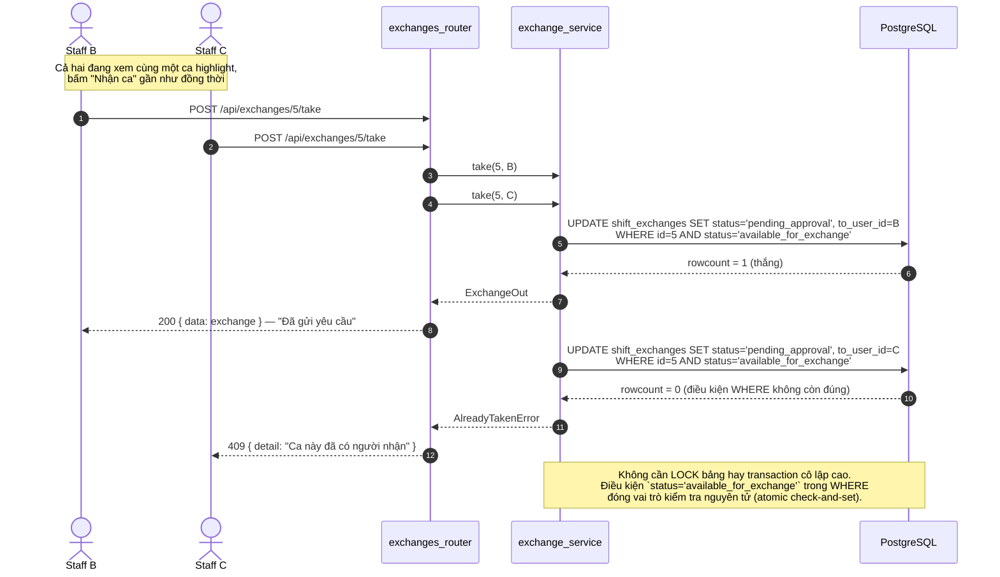

# SD-04 — Sequence Diagram: Pass ca / Nhận ca / Duyệt trao đổi ca

**Use Case**: UC-08 (Đăng pass ca) + UC-09 (Nhận ca) + UC-10 (Manager duyệt)
**Actor**: Staff A (người pass) · Staff B (người nhận) · Manager (người duyệt)
**Tham chiếu**: [module-exchange.md](../requirements/module-exchange.md) · [UC-03-to-14.md](../requirements/UC-03-to-14.md) · [activity-shift-exchange.md](activity-shift-exchange.md)

> **Version 1** chỉ có Pass ca + Nhận ca. Swap ca (đổi 2 chiều, bảng `swap_offers`) dời sang **Version 2**.
>
> Ký pháp UML: 3 **actor lifeline** cho 3 vai trò khác nhau, `alt/else` + guard `[...]`,
> `opt` cho fragment tùy chọn, `par` cho fan-out thông báo, `-->>` cho return message.
> Điểm nhấn của sơ đồ: **optimistic locking** khi nhiều Staff cùng bấm "Nhận ca" (BR-EX-02).

---

## 1. Sơ đồ chính — Toàn bộ vòng đời một yêu cầu trao đổi (Mermaid)

```mermaid
sequenceDiagram
    autonumber
    actor A as Staff A<br/>(pass ca)
    actor B as Staff B<br/>(nhận ca)
    actor M as Manager
    participant PG as ExchangeBoard<br/>(React)
    participant RT as exchanges_router<br/>(FastAPI)
    participant SV as exchange_service
    participant NS as notification_service
    participant DB as PostgreSQL<br/>(shifts, shift_exchanges)

    rect rgb(245, 245, 245)
    Note over A,DB: GIAI ĐOẠN 1 — Staff A đăng pass ca (UC-08)
    A->>PG: Mở Exchange Board, click ca của mình
    PG-->>A: Chi tiết ca + nút "Pass ca"
    A->>PG: Bấm "Pass ca", nhập lời nhắn
    PG->>RT: POST /api/exchanges { shift_id, message }
    RT->>SV: create(shift_id, message, current_user.id)
    SV->>DB: SELECT * FROM shifts WHERE id = :shift_id
    DB-->>SV: shift

    alt [ca không thuộc Staff A HOẶC đã diễn ra] — BR-EX-01
        SV-->>RT: InvalidShiftError
        RT-->>PG: 400 { detail: "Ca này đã diễn ra" / "Không phải ca của bạn" }
        PG-->>A: Toast lỗi
    else [hợp lệ]
        SV->>DB: BEGIN
        SV->>DB: INSERT INTO shift_exchanges<br/>(shift_id, from_user_id, status='available_for_exchange')
        SV->>DB: UPDATE shifts SET is_locked = TRUE WHERE id = :shift_id
        SV->>DB: COMMIT
        DB-->>SV: exchange row
        SV-->>RT: ExchangeOut
        RT-->>PG: 201 { data: exchange }
        PG-->>A: Ca chuyển màu highlight (cam) + lời nhắn
        PG-->>B: Ca hiện highlight trên Board của mọi Staff
    end
    end

    rect rgb(245, 245, 245)
    Note over A,DB: GIAI ĐOẠN 2 — Staff B nhận ca (UC-09)
    B->>PG: Click ca highlight
    PG-->>B: Chi tiết ca + lời nhắn của A + nút "Nhận ca"
    B->>PG: Bấm "Nhận ca"
    PG->>RT: POST /api/exchanges/{id}/take
    RT->>SV: take(exchange_id, current_user.id)

    alt [B chính là A] — BR-EX-03
        SV-->>RT: SelfTakeError
        RT-->>PG: 400 { detail: "Không thể tự nhận ca của mình" }
        PG-->>B: Toast lỗi
    else [B khác A]
        SV->>DB: SELECT * FROM shifts<br/>WHERE assigned_user_id = :B AND date = ca.date
        DB-->>SV: Các ca hiện có của B trong ngày
        SV->>SV: Kiểm tra chồng giờ (BR-EX-05)

        opt [phát hiện trùng giờ]
            SV-->>RT: { conflict: true, conflict_shift }
            RT-->>PG: 200 { data: { requires_confirm: true, message } }
            PG-->>B: Cảnh báo "Ca này trùng giờ với ca [ngày/giờ] của bạn"
            B->>PG: Bấm "Vẫn nhận"
            PG->>RT: POST /api/exchanges/{id}/take?confirm=true
            RT->>SV: take(exchange_id, B, confirm=true)
        end

        Note over SV,DB: OPTIMISTIC LOCKING — UPDATE có điều kiện,<br/>không dùng SELECT rồi UPDATE (tránh race condition).<br/>Lớp cuối: partial UNIQUE uq_exchange_active (NFR-REL-03)
        SV->>DB: UPDATE shift_exchanges<br/>SET status='pending_approval', to_user_id=:B, taken_at=NOW(),<br/>has_conflict=:c, conflict_note=:note<br/>WHERE id=:id AND status='available_for_exchange'
        DB-->>SV: rowcount (0 hoặc 1)

        alt [rowcount = 0 — người khác đã nhận trước] — BR-EX-02
            SV-->>RT: AlreadyTakenError
            RT-->>PG: 409 { detail: "Ca này đã có người nhận" }
            PG-->>B: Toast + reload Board (ca đổi sang màu tím "Đang chờ duyệt")
        else [rowcount = 1 — B thắng]
            SV->>NS: notify_exchange_request(manager_ids, A.id, exchange_id)
            par Thông báo cho Manager
                NS->>DB: INSERT notifications (type='exchange_request')
                NS-->>M: Push WebSocket + badge chuông
            and Thông báo cho Staff A
                NS->>DB: INSERT notifications (type='exchange_request')
                NS-->>A: "Staff B đã nhận ca của bạn, chờ Manager duyệt"
            end
            SV-->>RT: ExchangeOut (pending_approval)
            RT-->>PG: 200 { data: exchange }
            PG-->>B: "Đã gửi yêu cầu, chờ Manager duyệt" + ca khóa cho Staff khác
        end
    end
    end

    rect rgb(245, 245, 245)
    Note over A,DB: GIAI ĐOẠN 3 — Manager duyệt (UC-10)
    M->>PG: Mở thông báo, xem chi tiết yêu cầu
    PG->>RT: GET /api/exchanges?status=pending_approval
    RT->>DB: SELECT ... JOIN users, shifts
    DB-->>RT: Danh sách yêu cầu
    RT-->>PG: 200 { data: exchanges, total }
    PG-->>M: Ca của A, người nhận B, giờ giấc<br/>+ cảnh báo từ conflict_note nếu has_conflict = true

    alt [Manager duyệt] — FR-EXCHANGE-04
        M->>PG: Bấm "Duyệt"
        PG->>RT: PUT /api/exchanges/{id}/approve
        RT->>RT: Depends(get_current_manager) — RBAC
        RT->>SV: approve(exchange_id, manager.id)
        SV->>DB: BEGIN
        SV->>DB: UPDATE shift_exchanges SET status='approved',<br/>reviewed_by=:mgr, reviewed_at=NOW()
        SV->>DB: UPDATE shifts SET assigned_user_id = to_user_id,<br/>assignment_source = 'exchange', assigned_at = NOW(),<br/>is_locked = FALSE WHERE id = :shift_id
        SV->>DB: COMMIT
        DB-->>SV: OK
        SV->>NS: notify_exchange_approved(A.id, B.id, shift_id)
        par Thông báo cho Staff A
            NS-->>A: "Yêu cầu pass ca đã được duyệt"
        and Thông báo cho Staff B
            NS-->>B: "Bạn đã được nhận ca [ngày/giờ]"
        end
        SV-->>RT: ExchangeOut (approved)
        RT-->>PG: 200 { data: exchange }
        PG-->>M: Toast "Đã duyệt" — Roster cập nhật ca sang B (BR-EX-04)
    else [Manager từ chối]
        M->>PG: Bấm "Từ chối"
        PG->>RT: PUT /api/exchanges/{id}/reject
        RT->>SV: reject(exchange_id, manager.id)
        SV->>DB: BEGIN
        SV->>DB: UPDATE shift_exchanges SET status='rejected',<br/>reviewed_by=:mgr, reviewed_at=NOW()
        SV->>DB: UPDATE shifts SET is_locked = FALSE WHERE id = :shift_id
        SV->>DB: COMMIT
        DB-->>SV: OK
        SV->>NS: notify_exchange_rejected(A.id, B.id)
        par Thông báo cho Staff A
            NS-->>A: "Yêu cầu pass ca bị từ chối, ca vẫn thuộc về bạn"
        and Thông báo cho Staff B
            NS-->>B: "Yêu cầu nhận ca không được duyệt"
        end
        SV-->>RT: ExchangeOut (rejected)
        RT-->>PG: 200 { data: exchange }
        PG-->>M: Toast "Đã từ chối" — ca quay về Staff A
    end
    end
```

---

## 2. Sơ đồ phụ — Hai Staff cùng bấm "Nhận ca" (kiểm chứng BR-EX-02)

---

## 3. Ánh xạ lifeline sang tầng kiến trúc

| Lifeline | Thành phần thực tế | Vị trí mã nguồn (dự kiến) |
|----------|--------------------|---------------------------|
| `PG` | Bảng trao đổi ca + dialog chi tiết | `frontend/src/pages/ExchangePage.tsx`, `components/ExchangeCard.tsx` |
| `RT` | FastAPI router | `backend/app/api/exchanges.py` |
| `SV` | Nghiệp vụ: tạo/nhận/duyệt, kiểm tra trùng giờ | `backend/app/services/exchange_service.py` |
| `NS` | Sinh + phát thông báo cho A, B, Manager | `backend/app/services/notification_service.py` |
| `DB` | Bảng `shift_exchanges` + `shifts` | `backend/app/models/shift_exchange.py` |

---

## 4. Vòng đời trạng thái tương ứng với sơ đồ

| Giai đoạn | `shift_exchanges.status` | `shifts.status` | `shifts.is_locked` | `shifts.assigned_user_id` | `shifts.assignment_source` |
|-----------|--------------------------|-----------------|--------------------|---------------------------|----------------------------|
| Trước khi pass | — | `published` | `FALSE` | Staff A | `manual` / `auto` |
| A đăng pass | `available_for_exchange` | `published` | **`TRUE`** | Staff A | không đổi |
| B nhận ca | `pending_approval` | `published` | `TRUE` | Staff A (chưa đổi) | không đổi |
| Manager duyệt | `approved` | `published` | `FALSE` | **Staff B** | **`exchange`** |
| Manager từ chối | `rejected` | `published` | `FALSE` | Staff A | không đổi |
| A tự hủy (chưa ai nhận) | `cancelled` | `published` | `FALSE` | Staff A | không đổi |

> Khi `is_locked = TRUE`, Manager **không được** sửa/xóa ca đó trên Roster (BR-EX-06, ràng buộc với FR-ROSTER-05).
>
> ⚠️ Lưu ý so với bản ERD 1.0: `shifts.status` **không** còn giá trị `pending_exchange`. Trạng thái khóa được tách sang cột `is_locked` riêng, nhờ đó ca vẫn giữ được `published` xuyên suốt — giải quyết yêu cầu FR-EXCHANGE-04 *"reject thì ca quay về trạng thái ban đầu"* mà không cần lưu trạng thái cũ. Chi tiết xem [erd.md](../erd.md) mục 9, thay đổi #2.

---

## 5. Phân tích luồng

### Luồng chính (Happy path)

| Giai đoạn | Bước | Ghi chú |
|-----------|------|---------|
| 1 | A pass ca | 1 transaction ghi 2 bảng: tạo exchange + đổi status ca |
| 2 | B nhận ca | Kiểm tra trùng giờ trước, sau đó atomic check-and-set |
| 2 | Fan-out thông báo | `par` — Manager và Staff A được thông báo song song |
| 3 | Manager duyệt | Chuyển `assigned_user_id` sang B, ca trở lại `published` |

### Luồng ngoại lệ

| Ngoại lệ | Fragment | Xử lý |
|----------|----------|-------|
| Ca đã diễn ra / không phải ca của mình | `alt` giai đoạn 1 | 400, không tạo exchange (BR-EX-01) |
| Tự nhận ca của mình | `alt [B chính là A]` | 400 (BR-EX-03) |
| Ca nhận trùng giờ với ca sẵn có | `opt [phát hiện trùng giờ]` | Cảnh báo, **cho phép tiếp tục**, đánh dấu `has_conflict` để Manager thấy khi duyệt (BR-EX-05) |
| Hai người cùng nhận | `alt [rowcount = 0]` | 409, chỉ 1 người thành công (BR-EX-02) — xem sơ đồ mục 2 |
| Manager từ chối | `alt [Manager từ chối]` | Ca quay về A, cả A và B đều nhận thông báo |

### Điểm đúng chuẩn UML

- Sơ đồ có **ba actor lifeline** thay vì một "Người dùng" chung, tương ứng với ba swimlane của Activity Diagram AD-03 — thể hiện đúng bản chất **đa actor, bất đồng bộ theo thời gian** của luồng trao đổi ca (ba giai đoạn có thể cách nhau nhiều giờ).
- Ba khối `rect` + `Note` chia sơ đồ thành ba giai đoạn, giúp người đọc thấy đây là một quy trình dài chứ không phải một phiên tương tác liên tục.
- Cơ chế **optimistic locking** được vẽ thành **một message UPDATE duy nhất có điều kiện WHERE**, kèm return `rowcount` — chính xác hơn cách vẽ SELECT-rồi-UPDATE (vốn có race condition).
- `par` được dùng cho fan-out thông báo, phản ánh đúng việc một hành động sinh ra nhiều thông báo cho nhiều người nhận độc lập.
- Message từ `PG` tới lifeline actor **không phải người kích hoạt** (ví dụ `PG-->>B` ở giai đoạn 1) thể hiện việc Board của các Staff khác cũng cập nhật — hợp lý vì Exchange Board là dữ liệu dùng chung.
- Sơ đồ mục 2 là một **sequence diagram kiểm chứng nghiệp vụ**: cùng một endpoint nhưng hai lời gọi song song cho ra hai kết quả khác nhau, dùng làm cơ sở viết test case đồng thời (5 request → 1 thành công).

---

## 6. Xuất hình cho báo cáo

Xem [README.md](README.md).

> Sơ đồ mục 1 rất dài (3 giai đoạn). Nếu chèn vào Word bị nhỏ, có thể **tách thành 3 hình riêng**
> theo 3 giai đoạn (Hình 3.x-a Pass ca, 3.x-b Nhận ca, 3.x-c Duyệt) — mỗi hình một khối `rect`.

---

*Tài liệu phục vụ Chương 3.4 (Sequence Diagram) trong báo cáo đồ án.*
