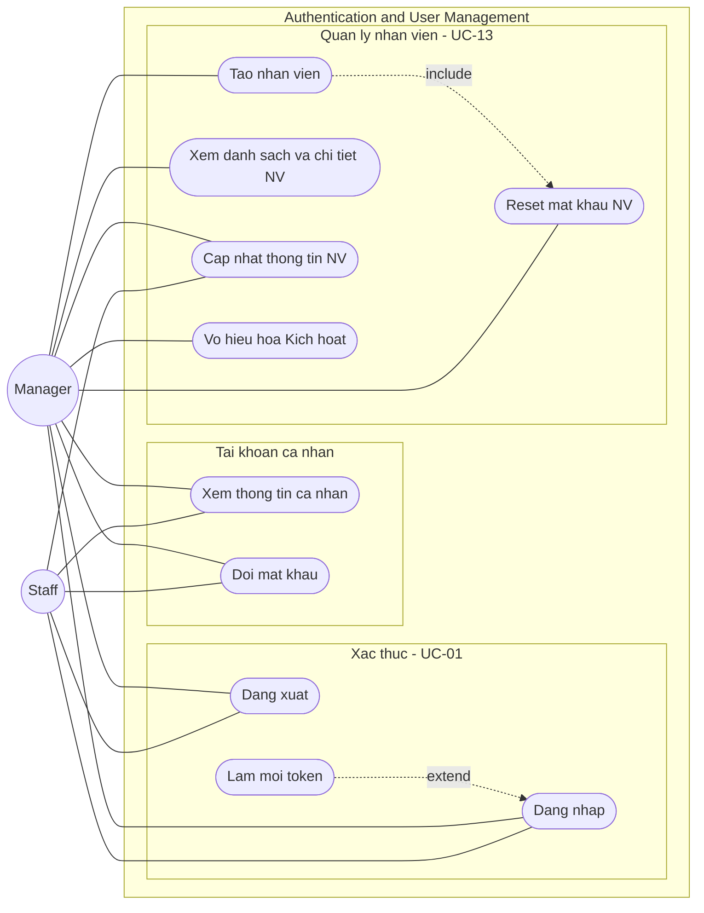

# UCD-01 — Use Case Diagram: Module Authentication & User Management

**Hệ thống**: Galaxy Staff
**Phạm vi**: Module Xác thực & Quản lý người dùng — gồm UC-01 (Đăng nhập/Đăng xuất) và UC-13 (Quản lý nhân viên), chi tiết theo FR-AUTH-01 → FR-AUTH-13.
**Actor**: Manager, Staff
**Tham chiếu**: [module-auth.md](../requirements/module-auth.md), [use-case-summary.md](../requirements/use-case-summary.md)



## Cách import vào draw.io (giữ shape rời, sửa được)

1. Mở [draw.io](https://app.diagrams.net/) → tạo file mới.
2. Menu **Extras → Edit Diagram…** (hoặc **Arrange → Insert → Advanced → Mermaid…** ở bản mới).
3. Copy nguyên mermaid block trên dán vào → **OK**.
4. Draw.io parse thành các shape độc lập: actor, use case, subgraph, mũi tên — click chọn riêng để chỉnh.
5. Vào **Edit Style** từng node để đổi:
   - Actor (vòng tròn) → `shape=umlActor` cho ký pháp stick-figure UML chuẩn.
   - Use case (stadium) → `ellipse;whiteSpace=wrap` cho hình bầu dục UML.
6. Lưu `.drawio` rồi export PNG/SVG cho báo cáo.

## Chú thích ký hiệu

| Ký hiệu | Ý nghĩa |
|---------|---------|
| `((Actor))` — vòng tròn | Actor (sau import → đổi sang `umlActor`) |
| `([Ten UC])` — stadium | Use case (sau import → đổi sang `ellipse`) |
| `---` — nét liền | Association (actor sử dụng use case) |
| `-.->|include|` — nét đứt + nhãn | «include» — A bắt buộc gọi B |
| `-.->|extend|` — nét đứt + nhãn | «extend» — B mở rộng A trong điều kiện nhất định |
| `subgraph` — khung | System boundary / nhóm chức năng |

## Phân tích các quan hệ đặc biệt

| Quan hệ | Ý nghĩa nghiệp vụ |
|---------|-------------------|
| `Làm mới token` **«extend»** `Đăng nhập` | Khi access token hết hạn, hệ thống dùng refresh token để cấp token mới mà không bắt đăng nhập lại (FR-AUTH-03). |
| `Tạo nhân viên` **«include»** `Reset mật khẩu NV` | Khi tạo tài khoản, hệ thống tự gán mật khẩu mặc định (`GalaxyStaff@123`) — chính là cơ chế reset (FR-AUTH-06, FR-AUTH-11). |

## Ánh xạ Use case → FR

| Use case (trên diagram) | FR liên quan | Quyền |
|-------------------------|--------------|-------|
| Đăng nhập | FR-AUTH-01 | Public |
| Đăng xuất | FR-AUTH-02 | Authenticated |
| Làm mới token | FR-AUTH-03 | Authenticated |
| Xem thông tin cá nhân | FR-AUTH-04 | Authenticated |
| Đổi mật khẩu | FR-AUTH-05 | Authenticated |
| Tạo nhân viên | FR-AUTH-06 | Manager |
| Xem danh sách và chi tiết NV | FR-AUTH-07, FR-AUTH-08 | Manager |
| Cập nhật thông tin NV | FR-AUTH-09 | Manager (tất cả) / Staff (chỉ bản thân) |
| Vô hiệu hóa / Kích hoạt | FR-AUTH-10 | Manager |
| Reset mật khẩu NV | FR-AUTH-11 | Manager |

## Ghi chú chung

- **Tiền điều kiện**: mọi use case (trừ *Đăng nhập*) đều ngầm yêu cầu một phiên đăng nhập hợp lệ — tương ứng `UC-01 «include»` ở sơ đồ tổng quan. Để tránh rối hình, các đường này được lược bỏ ở đây.
- **Phân quyền (RBAC)**: nhóm *Quản lý nhân viên* (FR-AUTH-06 → 11) bắt buộc đi qua **RBAC middleware (FR-AUTH-12)** ở backend và **Route Guard (FR-AUTH-13)** ở frontend — đây là cơ chế chắn chéo (cross-cutting), thể hiện bằng ghi chú thay vì use case riêng.
- **Cập nhật thông tin NV** là use case dùng chung hai actor với phạm vi khác nhau: Manager sửa mọi nhân viên, Staff chỉ sửa thông tin của chính mình (không tự đổi `role`).
- Hai actor **không** dùng Generalization vì tập use case không bao hàm hoàn toàn (Staff chỉ truy cập 5/10 use case của module).
```
