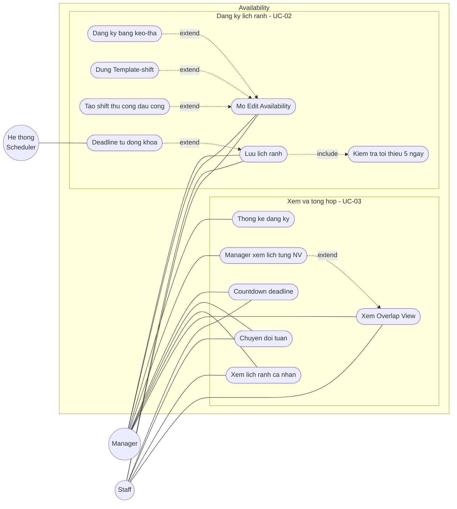

# UCD-02 — Use Case Diagram: Module Availability

**Hệ thống**: Galaxy Staff
**Phạm vi**: Module Đăng ký lịch rảnh — gồm UC-02 (Đăng ký lịch rảnh) và UC-03 (Xem tổng hợp lịch rảnh / Overlap View), chi tiết theo FR-AVAIL-01 → FR-AVAIL-13.
**Actor**: Manager, Staff, Hệ thống (scheduler — tự động khóa deadline)
**Tham chiếu**: [module-availability.md](../requirements/module-availability.md), [use-case-summary.md](../requirements/use-case-summary.md)



## Cách import vào draw.io (giữ shape rời, sửa được)

1. Mở [draw.io](https://app.diagrams.net/) → tạo file mới.
2. Menu **Extras → Edit Diagram…** (hoặc **Arrange → Insert → Advanced → Mermaid…** ở bản mới).
3. Copy nguyên mermaid block trên dán vào → **OK**.
4. Draw.io parse thành các shape độc lập: actor, use case, subgraph, mũi tên — click chọn riêng để chỉnh.
5. Vào **Edit Style** từng node để đổi:
   - Actor (vòng tròn) → `shape=umlActor` cho ký pháp stick-figure UML chuẩn.
   - Use case (stadium) → `ellipse;whiteSpace=wrap` cho hình bầu dục UML.
6. Lưu `.drawio` rồi export PNG/SVG cho báo cáo.

## Chú thích ký hiệu

| Ký hiệu | Ý nghĩa |
|---------|---------|
| `((Actor))` — vòng tròn | Actor (sau import → đổi sang `umlActor`) |
| `([Ten UC])` — stadium | Use case (sau import → đổi sang `ellipse`) |
| `---` — nét liền | Association (actor sử dụng use case) |
| `-.->|include|` — nét đứt + nhãn | «include» — A bắt buộc gọi B |
| `-.->|extend|` — nét đứt + nhãn | «extend» — A mở rộng B trong điều kiện nhất định |
| `subgraph` — khung | System boundary / nhóm chức năng |

## Phân tích các quan hệ đặc biệt

| Quan hệ | Ý nghĩa nghiệp vụ |
|---------|-------------------|
| `Đăng ký bằng kéo-thả` **«extend»** `Mở Edit Availability` | Kéo-thả là một cách nhập lịch rảnh (tùy chọn) trên cùng màn Edit (FR-AVAIL-03). |
| `Dùng Template-shift` **«extend»** `Mở Edit Availability` | Áp mẫu Sáng/Chiều/Tối/Full — cách nhập nhanh thay cho kéo-thả (FR-AVAIL-04). |
| `Tạo shift thủ công (+)` **«extend»** `Mở Edit Availability` | Nhập tay giờ bắt đầu/kết thúc khi không muốn kéo-thả (FR-AVAIL-05). |
| `Lưu lịch rảnh` **«include»** `Kiểm tra tối thiểu 5 ngày` | Mỗi lần lưu hệ thống bắt buộc kiểm tra điều kiện ≥ 5 ngày, cảnh báo nếu thiếu (FR-AVAIL-06, 07). |
| `Manager xem lịch từng NV` **«extend»** `Xem Overlap View` | Từ Overlap View, Manager click tên một NV để drill-down xem grid cá nhân (FR-AVAIL-10). |
| `Deadline tự động khóa` **«extend»** `Lưu lịch rảnh` | Sau 18h Thứ 7, hệ thống khóa thao tác lưu/sửa của tuần đó (FR-AVAIL-08). |

## Ánh xạ Use case → FR

| Use case (trên diagram) | FR liên quan | Actor | Ưu tiên |
|-------------------------|--------------|-------|---------|
| Mở Edit Availability | FR-AVAIL-02 | Both | Must |
| Đăng ký bằng kéo-thả | FR-AVAIL-03 | Both | Must |
| Dùng Template-shift | FR-AVAIL-04 | Both | Must |
| Tạo shift thủ công (+) | FR-AVAIL-05 | Both | Must |
| Lưu lịch rảnh | FR-AVAIL-06 | Both | Must |
| Kiểm tra tối thiểu 5 ngày | FR-AVAIL-07 | Both | Must |
| Deadline tự động khóa | FR-AVAIL-08 | Hệ thống | Must |
| Xem Overlap View | FR-AVAIL-01 | Both | Must |
| Xem lịch rảnh cá nhân | FR-AVAIL-09 | Both | Must |
| Manager xem lịch từng NV | FR-AVAIL-10 | Manager | Should |
| Thống kê đăng ký | FR-AVAIL-11 | Manager | Should |
| Chuyển đổi tuần | FR-AVAIL-12 | Both | Should |
| Countdown deadline | FR-AVAIL-13 | Both | Could |

## Ghi chú chung

- **Tiền điều kiện**: mọi use case trong module đều ngầm yêu cầu phiên đăng nhập hợp lệ (`«include» UC-01`) — lược bỏ trên hình cho gọn.
- **Actor Hệ thống (Scheduler)**: *Deadline tự động khóa* (FR-AVAIL-08) do tác nhân thời gian kích hoạt lúc 18h Thứ 7, không do người dùng — nên gắn với actor "Hệ thống" thay vì Manager/Staff.
- **Phạm vi đăng ký**: tuần từ Thứ 6 đến Thứ 5 tuần sau, grid 7 ngày × ô 30 phút (8h–02h). Sau deadline → chỉ đọc.
- **Hai actor Manager/Staff** dùng chung phần lớn use case đăng ký (vì Manager cũng tự đăng ký lịch rảnh); riêng *Manager xem lịch từng NV* và *Thống kê đăng ký* chỉ thuộc Manager — nên **không** dùng Generalization giữa hai actor.
```
