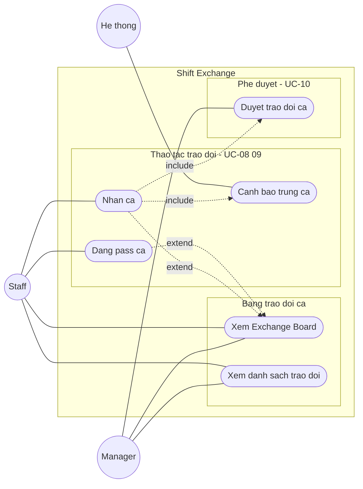

# UCD-04 — Use Case Diagram: Module Shift Exchange

**Hệ thống**: Galaxy Staff
**Phạm vi**: Module Trao đổi ca — gồm UC-08 (Pass ca), UC-09 (Nhận ca), UC-10 (Duyệt trao đổi ca), chi tiết theo FR-EXCHANGE-01 → FR-EXCHANGE-06 (trừ FR-EXCHANGE-03 Swap ca — dành cho Version 2).
**Actor**: Manager, Staff, Hệ thống (kiểm tra trùng ca / optimistic lock)
**Tham chiếu**: [module-exchange.md](../requirements/module-exchange.md), [use-case-summary.md](../requirements/use-case-summary.md). Phụ thuộc lịch đã publish: xem [usecase-roster.md](usecase-roster.md).



## Cách import vào draw.io (giữ shape rời, sửa được)

1. Mở [draw.io](https://app.diagrams.net/) → tạo file mới.
2. Menu **Extras → Edit Diagram…** (hoặc **Arrange → Insert → Advanced → Mermaid…** ở bản mới).
3. Copy nguyên mermaid block trên dán vào → **OK**.
4. Draw.io parse thành các shape độc lập: actor, use case, subgraph, mũi tên — click chọn riêng để chỉnh.
5. Vào **Edit Style** từng node để đổi:
   - Actor (vòng tròn) → `shape=umlActor` cho ký pháp stick-figure UML chuẩn.
   - Use case (stadium) → `ellipse;whiteSpace=wrap` cho hình bầu dục UML.
6. Lưu `.drawio` rồi export PNG/SVG cho báo cáo.

## Chú thích ký hiệu

| Ký hiệu | Ý nghĩa |
|---------|---------|
| `((Actor))` — vòng tròn | Actor (sau import → đổi sang `umlActor`) |
| `([Ten UC])` — stadium | Use case (sau import → đổi sang `ellipse`) |
| `---` — nét liền | Association (actor sử dụng use case) |
| `-.->|include|` — nét đứt + nhãn | «include» — A bắt buộc gọi B |
| `-.->|extend|` — nét đứt + nhãn | «extend» — A mở rộng B trong điều kiện nhất định |
| `subgraph` — khung | System boundary / nhóm chức năng |

## Phân tích các quan hệ đặc biệt

| Quan hệ | Ý nghĩa nghiệp vụ |
|---------|-------------------|
| `Đăng pass ca` **«extend»** `Xem Exchange Board` | Trên Board, Staff click ca của mình để pass (kèm lời nhắn) — ca chuyển highlight (FR-EXCHANGE-01). |
| `Nhận ca` **«extend»** `Xem Exchange Board` | Staff khác click ca highlight trên Board rồi bấm "Nhận ca" (FR-EXCHANGE-02). |
| `Nhận ca` **«include»** `Cảnh báo trùng ca` | Khi nhận, hệ thống bắt buộc kiểm tra ca có trùng giờ ca hiện có không (BR-EX-05). |
| `Nhận ca` **«include»** `Duyệt trao đổi ca` | Sau khi B nhận, yêu cầu bắt buộc đẩy lên Manager phê duyệt (FR-EXCHANGE-04). |

## Ánh xạ Use case → FR

| Use case (trên diagram) | FR liên quan | Actor | Ưu tiên |
|-------------------------|--------------|-------|---------|
| Đăng pass ca | FR-EXCHANGE-01 | Staff | Should |
| Nhận ca | FR-EXCHANGE-02 | Staff | Should |
| Cảnh báo trùng ca | FR-EXCHANGE-02 (BR-EX-05) | Hệ thống | Should |
| Duyệt trao đổi ca | FR-EXCHANGE-04 | Manager | Should |
| Xem danh sách trao đổi | FR-EXCHANGE-05 | Both | Should |
| Xem Exchange Board | FR-EXCHANGE-06 | Both | Should |

## Ghi chú chung

- **Tiền điều kiện**: mọi use case đều ngầm yêu cầu phiên đăng nhập hợp lệ (`«include» UC-01`) và lịch làm đã được publish (xem [usecase-roster.md](usecase-roster.md)).
- **Giao diện Board**: trang chính hiển thị tuần làm như Roster — ca thường xám/nhạt, ca đang trao đổi highlight; click ca để xem lời nhắn + nút Nhận (FR-EXCHANGE-06).
- **Actor Hệ thống**: đảm nhiệm *Cảnh báo trùng ca* và **optimistic lock** (Pending lock — chỉ 1 người nhận thành công trên cùng một ca, BR-EX-02).
- **Liên kết liên-module**: mỗi bước trao đổi (nhận / approve / reject) đều bắn notification — thuộc Notification (FR-NOTIF-04), xem [usecase-news.md](usecase-news.md).
- **Hai actor Manager/Staff** không dùng Generalization: Staff thực hiện pass/nhận, Manager chỉ phê duyệt; cả hai cùng xem Board và danh sách.
- **Swap ca** (đổi ca 2 chiều) được đưa vào **Version 2** — xem ghi chú trong [module-exchange.md](../requirements/module-exchange.md).
```
