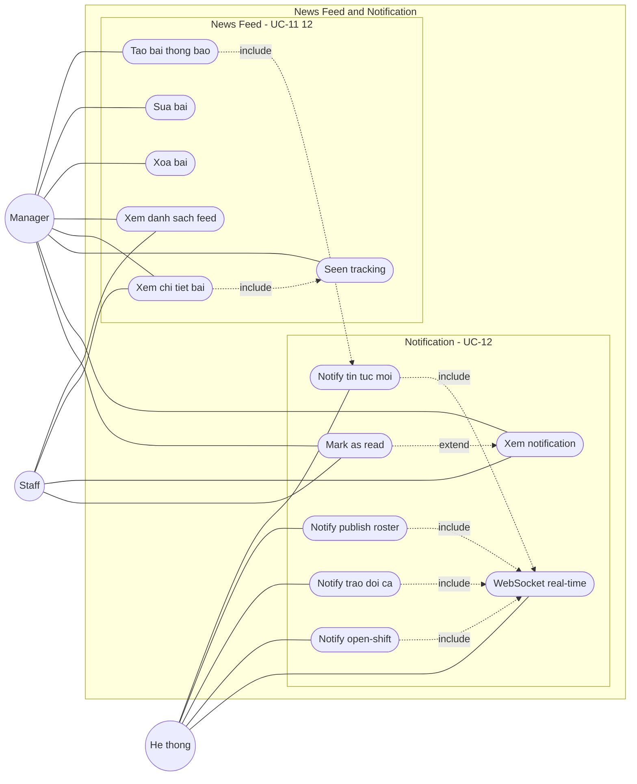

# UCD-05 — Use Case Diagram: Module News Feed & Notification

**Hệ thống**: Galaxy Staff
**Phạm vi**: Module Bảng tin nội bộ & Thông báo — gồm UC-11 (Tạo thông báo nội bộ) và UC-12 (Xem thông báo), chi tiết theo FR-NEWS-01 → FR-NEWS-06 và FR-NOTIF-01 → FR-NOTIF-07.
**Actor**: Manager, Staff, Hệ thống (tự động bắn notification)
**Tham chiếu**: [module-news.md](../requirements/module-news.md), [use-case-summary.md](../requirements/use-case-summary.md)



## Cách import vào draw.io (giữ shape rời, sửa được)

1. Mở [draw.io](https://app.diagrams.net/) → tạo file mới.
2. Menu **Extras → Edit Diagram…** (hoặc **Arrange → Insert → Advanced → Mermaid…** ở bản mới).
3. Copy nguyên mermaid block trên dán vào → **OK**.
4. Draw.io parse thành các shape độc lập: actor, use case, subgraph, mũi tên — click chọn riêng để chỉnh.
5. Vào **Edit Style** từng node để đổi:
   - Actor (vòng tròn) → `shape=umlActor` cho ký pháp stick-figure UML chuẩn.
   - Use case (stadium) → `ellipse;whiteSpace=wrap` cho hình bầu dục UML.
6. Lưu `.drawio` rồi export PNG/SVG cho báo cáo.

## Chú thích ký hiệu

| Ký hiệu | Ý nghĩa |
|---------|---------|
| `((Actor))` — vòng tròn | Actor (sau import → đổi sang `umlActor`) |
| `([Ten UC])` — stadium | Use case (sau import → đổi sang `ellipse`) |
| `---` — nét liền | Association (actor sử dụng use case) |
| `-.->|include|` — nét đứt + nhãn | «include» — A bắt buộc gọi B |
| `-.->|extend|` — nét đứt + nhãn | «extend» — A mở rộng B trong điều kiện nhất định |
| `subgraph` — khung | System boundary / nhóm chức năng |

## Phân tích các quan hệ đặc biệt

| Quan hệ | Ý nghĩa nghiệp vụ |
|---------|-------------------|
| `Tạo bài thông báo` **«include»** `Notify tin tức mới` | Mỗi bài đăng bắt buộc fan-out notification đến toàn bộ Staff (FR-NEWS-01, FR-NOTIF-05). |
| `Xem chi tiết bài` **«include»** `Seen tracking` | Khi Staff mở bài, hệ thống tự ghi nhận "đã đọc"; Manager xem được danh sách ai đã/chưa đọc (FR-NEWS-03, FR-NEWS-06). |
| `Mark as read` **«extend»** `Xem notification` | Trên danh sách chuông, người dùng có thể đánh dấu một / tất cả thông báo đã đọc (FR-NOTIF-02). |
| `Notify *` **«include»** `WebSocket real-time` | Mọi loại notification được đẩy real-time qua WebSocket; fallback polling 30s nếu mất kết nối (FR-NOTIF-06). |

## Ánh xạ Use case → FR

| Use case (trên diagram) | FR liên quan | Actor | Ưu tiên |
|-------------------------|--------------|-------|---------|
| Tạo bài thông báo | FR-NEWS-01 | Manager | Must |
| Sửa bài | FR-NEWS-04 | Manager | Should |
| Xóa bài | FR-NEWS-05 | Manager | Should |
| Xem danh sách feed | FR-NEWS-02 | Both | Must |
| Xem chi tiết bài | FR-NEWS-03 | Both | Must |
| Seen tracking | FR-NEWS-06 | Manager | Must |
| Xem notification | FR-NOTIF-01 | Both | Must |
| Mark as read | FR-NOTIF-02 | Both | Must |
| Notify publish roster | FR-NOTIF-03 | Hệ thống | Must |
| Notify trao đổi ca | FR-NOTIF-04 | Hệ thống | Should |
| Notify tin tức mới | FR-NOTIF-05 | Hệ thống | Must |
| WebSocket real-time | FR-NOTIF-06 | Hệ thống | Should |
| Notify open-shift | FR-NOTIF-07 | Hệ thống | Should |

## Ghi chú chung

- **Tiền điều kiện**: mọi use case đều ngầm yêu cầu phiên đăng nhập hợp lệ (`«include» UC-01`) — lược bỏ trên hình cho gọn.
- **Nguồn kích hoạt notification (liên-module)**: *Notify publish roster* (FR-NOTIF-03) ← Publish ở [usecase-roster.md](usecase-roster.md); *Notify trao đổi ca* (FR-NOTIF-04) ← nhận/approve/reject ở [usecase-exchange.md](usecase-exchange.md); *Notify open-shift* (FR-NOTIF-07) ← Apply Open-shift; *Notify tin tức mới* (FR-NOTIF-05) ← Tạo bài trong chính module này.
- **Actor Hệ thống**: toàn bộ nhóm `Notify *` và *WebSocket real-time* do hệ thống tự động kích hoạt khi có sự kiện, không do người dùng thao tác trực tiếp.
- **Sửa/Xóa bài** (FR-NEWS-04/05) là thao tác CRUD bổ sung của Manager trên bài đã đăng; bài sửa hiển thị nhãn "Đã chỉnh sửa", xóa là soft-delete.
- **Hai actor Manager/Staff** không dùng Generalization: Manager có thêm quyền tạo/sửa/xóa bài và xem Seen tracking; Staff chỉ đọc feed và nhận/đọc notification.
```
