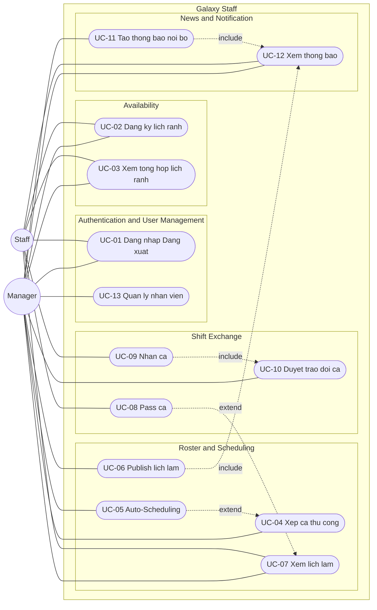

# UCD-00 — Use Case Diagram tổng quan

**Hệ thống**: Galaxy Staff
**Phạm vi**: Toàn bộ 13 use case, 2 actor (Manager, Staff), 5 module nghiệp vụ.
**Tham chiếu**: [use-case-summary.md](../requirements/use-case-summary.md)

## Cách import vào draw.io (giữ shape rời, sửa được)

1. Mở [draw.io](https://app.diagrams.net/) → tạo file mới.
2. Menu **Extras → Edit Diagram…** (hoặc **Arrange → Insert → Advanced → Mermaid…** ở bản mới).
3. Copy nguyên mermaid block trên dán vào → **OK**.
4. Draw.io sẽ parse thành **các shape độc lập**: actor, use case, subgraph, mũi tên — mỗi cái click chọn riêng để đổi vị trí / màu / font / shape.
5. Sau khi import, vào **Edit Style** từng node để đổi:
   - Actor (vòng tròn) → `shape=umlActor` cho ra ký pháp stick-figure chuẩn UML.
   - Use case (stadium) → `ellipse;whiteSpace=wrap` cho ra hình bầu dục UML.
6. Lưu lại dạng `.drawio` rồi export PNG/SVG cho báo cáo.

## Chú thích ký hiệu

| Ký hiệu | Ý nghĩa |
|---------|---------|
| `((Actor))` — vòng tròn | Actor (sau import → đổi sang `umlActor` trong draw.io) |
| `([UC-XX ...])` — stadium | Use case (sau import → đổi sang `ellipse` trong draw.io) |
| `---` — nét liền | Association (actor sử dụng use case) |
| `-.->|include|` — nét đứt + nhãn | «include» — A bắt buộc gọi B |
| `-.->|extend|` — nét đứt + nhãn | «extend» — A mở rộng B trong điều kiện nhất định |
| `subgraph` — khung | System boundary / Module boundary |

## Phân tích các quan hệ đặc biệt

| Quan hệ | Ý nghĩa nghiệp vụ |
|---------|-------------------|
| `UC-06 Publish lịch làm` **«include»** `UC-12 Xem thông báo` | Khi publish, hệ thống bắt buộc fan-out notification đến toàn bộ Staff. |
| `UC-11 Tạo thông báo nội bộ` **«include»** `UC-12 Xem thông báo` | Tạo bài bắt buộc kèm notification cho Staff. |
| `UC-09 Nhận ca` **«include»** `UC-10 Duyệt trao đổi ca` | Staff B bấm "Nhận ca" → bắt buộc đẩy yêu cầu lên Manager phê duyệt. |
| `UC-05 Auto-Scheduling` **«extend»** `UC-04 Xếp ca thủ công` | Auto-Schedule là nhánh mở rộng — Manager có thể xếp tay hoặc bấm tự động ở cùng màn Roster. |
| `UC-08 Pass ca` **«extend»** `UC-07 Xem lịch làm` | Trên màn xem lịch, Staff có thể chọn pass một ca cụ thể (nhánh tùy chọn). |

## Ghi chú chung

- **Tiền điều kiện toàn hệ thống**: mọi UC từ UC-02 đến UC-14 đều ngầm `«include» UC-01` (yêu cầu phiên đăng nhập hợp lệ). Để tránh rối hình, các đường này được lược bỏ trên diagram tổng quan.
- **Phân quyền (RBAC)** được thể hiện ngầm qua association: Manager kết nối tới 11/13 UC, Staff tới 6/13 UC — không trùng hoàn toàn nên **không** dùng Generalization giữa hai actor.
- **System boundary** chia theo 5 module nghiệp vụ (Auth, Availability, Roster, Shift Exchange, News & Notification) — trùng với cấu trúc folder `backend/app/api/` để dễ trace requirement → code.
