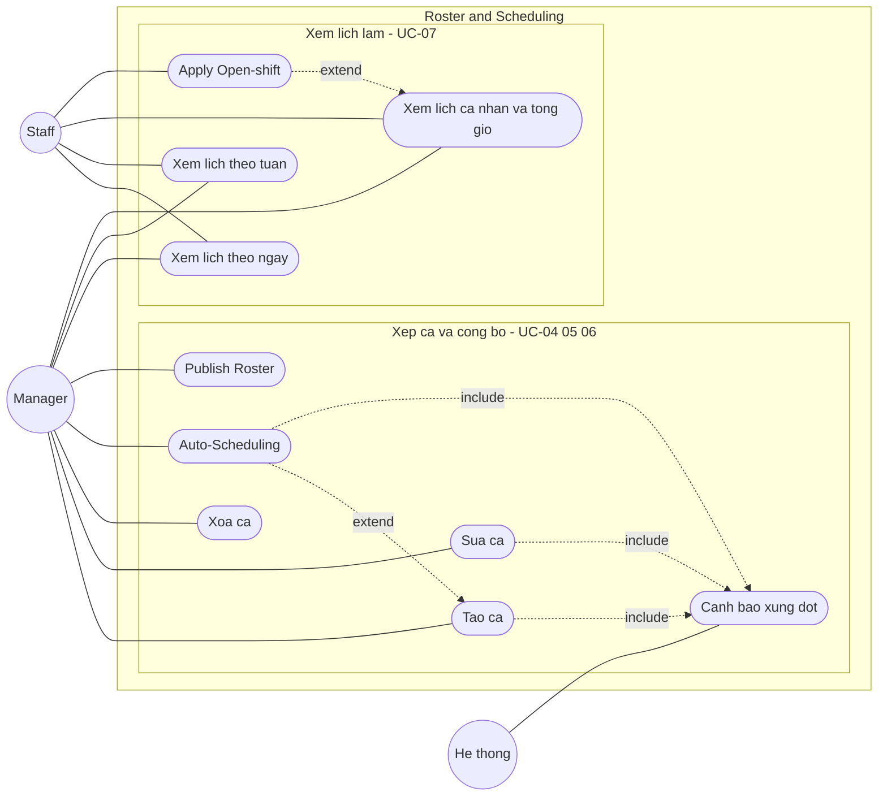

# UCD-03 — Use Case Diagram: Module Roster & Scheduling

**Hệ thống**: Galaxy Staff
**Phạm vi**: Module Lịch làm việc — gồm UC-04 (Xếp ca thủ công), UC-05 (Auto-Scheduling), UC-06 (Publish lịch làm), UC-07 (Xem lịch làm), chi tiết theo FR-ROSTER-01 → FR-ROSTER-10.
**Actor**: Manager, Staff, Hệ thống (kiểm tra xung đột)
**Tham chiếu**: [module-roster.md](../requirements/module-roster.md), [use-case-summary.md](../requirements/use-case-summary.md). Trao đổi ca sau publish: xem [usecase-exchange.md](usecase-exchange.md).



## Cách import vào draw.io (giữ shape rời, sửa được)

1. Mở [draw.io](https://app.diagrams.net/) → tạo file mới.
2. Menu **Extras → Edit Diagram…** (hoặc **Arrange → Insert → Advanced → Mermaid…** ở bản mới).
3. Copy nguyên mermaid block trên dán vào → **OK**.
4. Draw.io parse thành các shape độc lập: actor, use case, subgraph, mũi tên — click chọn riêng để chỉnh.
5. Vào **Edit Style** từng node để đổi:
   - Actor (vòng tròn) → `shape=umlActor` cho ký pháp stick-figure UML chuẩn.
   - Use case (stadium) → `ellipse;whiteSpace=wrap` cho hình bầu dục UML.
6. Lưu `.drawio` rồi export PNG/SVG cho báo cáo.

## Chú thích ký hiệu

| Ký hiệu | Ý nghĩa |
|---------|---------|
| `((Actor))` — vòng tròn | Actor (sau import → đổi sang `umlActor`) |
| `([Ten UC])` — stadium | Use case (sau import → đổi sang `ellipse`) |
| `---` — nét liền | Association (actor sử dụng use case) |
| `-.->|include|` — nét đứt + nhãn | «include» — A bắt buộc gọi B |
| `-.->|extend|` — nét đứt + nhãn | «extend» — A mở rộng B trong điều kiện nhất định |
| `subgraph` — khung | System boundary / nhóm chức năng |

## Phân tích các quan hệ đặc biệt

| Quan hệ | Ý nghĩa nghiệp vụ |
|---------|-------------------|
| `Auto-Scheduling` **«extend»** `Tạo ca` | Auto-Schedule là nhánh mở rộng của việc xếp ca thủ công — Manager có thể xếp tay hoặc bấm tự động ở cùng màn Roster (FR-ROSTER-06). |
| `Tạo ca` **«include»** `Cảnh báo xung đột` | Mỗi lần tạo ca, hệ thống bắt buộc kiểm tra chồng giờ / quá 48h / NV bận (FR-ROSTER-07). |
| `Sửa ca` **«include»** `Cảnh báo xung đột` | Tương tự, kiểm tra ràng buộc khi thay đổi giờ hoặc đổi người. |
| `Auto-Scheduling` **«include»** `Cảnh báo xung đột` | Thuật toán greedy tự tuân thủ ràng buộc; ca không gán được giữ lại ở Open-shift kèm cảnh báo. |
| `Apply Open-shift` **«extend»** `Xem lịch cá nhân và tổng giờ` | Trên màn xem lịch, Staff thấy hàng Open-shift và có thể bấm "Apply" để nhận ca trống (FR-ROSTER-09). |

## Ánh xạ Use case → FR

| Use case (trên diagram) | FR liên quan | Actor | Ưu tiên |
|-------------------------|--------------|-------|---------|
| Tạo ca | FR-ROSTER-03 | Manager | Must |
| Sửa ca | FR-ROSTER-04 | Manager | Must |
| Xóa ca | FR-ROSTER-05 | Manager | Must |
| Auto-Scheduling | FR-ROSTER-06 | Manager | Must |
| Cảnh báo xung đột | FR-ROSTER-07 | Hệ thống | Must |
| Publish Roster | FR-ROSTER-08 | Manager | Must |
| Xem lịch theo ngày | FR-ROSTER-01 | Both | Must |
| Xem lịch theo tuần | FR-ROSTER-02 | Both | Must |
| Xem lịch cá nhân và tổng giờ | FR-ROSTER-10 | Staff (Manager xem được) | Must |
| Apply Open-shift | FR-ROSTER-09 | Staff | Should |

## Ghi chú chung

- **Tiền điều kiện**: mọi use case trong module đều ngầm yêu cầu phiên đăng nhập hợp lệ (`«include» UC-01`) — lược bỏ trên hình cho gọn.
- **Liên kết liên-module**: *Publish Roster* (FR-ROSTER-08) bắt buộc kéo theo gửi thông báo cho toàn bộ Staff — chức năng này thuộc module Notification (FR-NOTIF-03), thể hiện trong [usecase-news.md](usecase-news.md) để tránh trùng lặp.
- **Phụ thuộc Availability**: Auto-Scheduling dùng dữ liệu lịch rảnh đã đăng ký (sau deadline) làm đầu vào — xem [usecase-availability.md](usecase-availability.md).
- **Trao đổi ca sau publish** (pass / nhận) là module riêng — xem [usecase-exchange.md](usecase-exchange.md).
- **Actor Hệ thống**: *Cảnh báo xung đột* (FR-ROSTER-07) là tác nhân tự động chạy nền khi Manager thao tác xếp ca, nên gắn với actor "Hệ thống".
- **Hai actor Manager/Staff** không dùng Generalization: Manager nắm toàn bộ thao tác xếp ca/publish, Staff chỉ xem lịch và apply Open-shift.
```
