# ERD — Sơ đồ Quan hệ Thực thể (Entity-Relationship Diagram)

**Hệ thống**: Galaxy Staff — Quản lý Nhân sự Rạp Chiếu Phim
**CSDL**: PostgreSQL 16 · ORM: SQLAlchemy 2.0 · Migration: Alembic
**Số thực thể**: 11 bảng — `locations`, `users`, `availability_submissions`, `availabilities`, `shifts`, `shift_applications`, `shift_exchanges`, `news_posts`, `news_images`, `news_reads`, `notifications`
**Chuẩn hóa**: 3NF (Third Normal Form)
**Phiên bản tài liệu**: 2.0 (đã soát chéo với toàn bộ 55 FR + BR — xem [mục 9](#9-lịch-sử-thay-đổi--quyết-định-thiết-kế))
**Tham chiếu**: [chapter3-requirements.md](requirements/chapter3-requirements.md), [module-exchange.md](requirements/module-exchange.md), [module-roster.md](requirements/module-roster.md)

> **Version 1**: bảng `swap_offers` (tính năng Swap ca 2 chiều) được dời sang **Version 2** — không có trong ERD này.

---

## 1. Sơ đồ ERD (Mermaid — ký pháp Crow's Foot)

```mermaid
erDiagram
    LOCATIONS                ||--o{ USERS                     : "thuộc về"
    LOCATIONS                ||--o{ SHIFTS                    : "diễn ra tại"
    USERS                    ||--o{ AVAILABILITY_SUBMISSIONS   : "đăng ký theo tuần"
    AVAILABILITY_SUBMISSIONS ||--|{ AVAILABILITIES            : "gồm các khung giờ"
    USERS                    ||--o{ SHIFTS                    : "tạo (created_by)"
    USERS                    |o--o{ SHIFTS                    : "được gán (assigned_user_id)"
    SHIFTS                   ||--o{ SHIFT_APPLICATIONS        : "được xin nhận"
    USERS                    ||--o{ SHIFT_APPLICATIONS        : "xin nhận (user_id)"
    USERS                    |o--o{ SHIFT_APPLICATIONS        : "xét duyệt (reviewed_by)"
    SHIFTS                   ||--o{ SHIFT_EXCHANGES           : "được trao đổi"
    USERS                    ||--o{ SHIFT_EXCHANGES           : "đăng pass (from_user_id)"
    USERS                    |o--o{ SHIFT_EXCHANGES           : "nhận (to_user_id)"
    USERS                    |o--o{ SHIFT_EXCHANGES           : "xét duyệt (reviewed_by)"
    USERS                    ||--o{ NEWS_POSTS                : "đăng bài (author_id)"
    NEWS_POSTS               ||--o{ NEWS_IMAGES               : "đính kèm ảnh"
    NEWS_POSTS               ||--o{ NEWS_READS                : "được đọc"
    USERS                    ||--o{ NEWS_READS                : "đọc bài"
    USERS                    ||--o{ NOTIFICATIONS             : "nhận thông báo"

    LOCATIONS {
        int         id          PK "Khóa chính"
        varchar     name        "Tên rạp, NOT NULL"
        varchar     address     "Địa chỉ"
        timestamptz created_at  "Mặc định NOW()"
    }

    USERS {
        int         id                   PK "Khóa chính"
        varchar     email                UK "Duy nhất, NOT NULL"
        varchar     password_hash        "bcrypt cost 12, NOT NULL"
        varchar     full_name            "Họ tên, NOT NULL"
        user_role   role                 "ENUM manager|staff, NOT NULL"
        int         location_id          FK "→ locations.id, NOT NULL"
        boolean     is_active            "Mặc định TRUE, soft delete"
        boolean     must_change_password "Mặc định TRUE, mật khẩu mặc định"
        timestamptz created_at           "Mặc định NOW()"
        timestamptz updated_at           "NULL nếu chưa sửa"
    }

    AVAILABILITY_SUBMISSIONS {
        int         id           PK "Khóa chính"
        int         user_id      FK "→ users.id, NOT NULL"
        date        week_start   "Thứ 6 đầu tuần rạp, NOT NULL"
        smallint    total_days   "Số ngày có đăng ký, 0-7"
        text        reason       "Lý do nếu dưới 5 ngày, NULLABLE"
        timestamptz submitted_at "Mặc định NOW()"
        timestamptz updated_at   "NULL nếu chưa sửa lại"
    }

    AVAILABILITIES {
        int         id            PK "Khóa chính"
        int         submission_id FK "→ availability_submissions.id, NOT NULL"
        smallint    day_of_week   "0=T6 .. 6=T5, CHECK 0-6"
        time        start_time    "Giờ bắt đầu rảnh, NOT NULL"
        time        end_time      "Giờ kết thúc, cho phép qua nửa đêm"
        timestamptz created_at    "Mặc định NOW()"
    }

    SHIFTS {
        int           id                PK "Khóa chính"
        int           location_id       FK "→ locations.id, NOT NULL"
        date          work_date         "Ngày vận hành, NOT NULL"
        date          week_start        "Thứ 6 đầu tuần rạp, NOT NULL"
        timestamptz   start_at          "Bắt đầu ca, NOT NULL"
        timestamptz   end_at            "Kết thúc ca, CHECK end_at gt start_at"
        int           assigned_user_id  FK "→ users.id, NULL = Open-shift"
        assign_source assignment_source "ENUM manual|auto|application|exchange"
        timestamptz   assigned_at       "Thời điểm gán, NULLABLE"
        shift_status  status            "ENUM draft|published"
        boolean       is_locked         "TRUE khi đang trao đổi hoặc chờ duyệt"
        varchar       unassigned_reason "Lý do auto-schedule không gán được"
        text          override_reason   "NOT NULL nếu Manager ghi đè cảnh báo"
        boolean       is_deleted        "Soft delete, mặc định FALSE"
        int           created_by        FK "→ users.id, NOT NULL"
        timestamptz   published_at      "Thời điểm publish, NULLABLE"
        timestamptz   created_at        "Mặc định NOW()"
        timestamptz   updated_at        "NULL nếu chưa sửa"
    }

    SHIFT_APPLICATIONS {
        int                id            PK "Khóa chính"
        int                shift_id      FK "→ shifts.id, NOT NULL"
        int                user_id       FK "→ users.id, người xin ca"
        apply_status       status        "ENUM pending|approved|rejected|cancelled"
        boolean            has_conflict  "Vi phạm constraint, mặc định FALSE"
        text               conflict_note "Mô tả vi phạm tại thời điểm xin"
        int                reviewed_by   FK "→ users.id, Manager xét, NULLABLE"
        timestamptz        created_at    "Mặc định NOW()"
        timestamptz        reviewed_at   "Thời điểm xét duyệt, NULLABLE"
    }

    SHIFT_EXCHANGES {
        int             id            PK "Khóa chính"
        int             shift_id      FK "→ shifts.id, NOT NULL"
        int             from_user_id  FK "→ users.id, Staff A đăng pass"
        int             to_user_id    FK "→ users.id, Staff B nhận, NULLABLE"
        text            message       "Lời nhắn, NULLABLE"
        exchange_status status        "ENUM 5 giá trị, xem mục 4"
        boolean         has_conflict  "Cảnh báo trùng giờ, mặc định FALSE"
        text            conflict_note "Chi tiết cảnh báo, snapshot khi nhận"
        int             reviewed_by   FK "→ users.id, Manager xét, NULLABLE"
        timestamptz     created_at    "Thời điểm đăng pass"
        timestamptz     taken_at      "Thời điểm Staff B nhận, NULLABLE"
        timestamptz     reviewed_at   "Thời điểm Manager xét, NULLABLE"
        timestamptz     cancelled_at  "Thời điểm A hủy pass, NULLABLE"
        timestamptz     updated_at    "Cập nhật khi đổi trạng thái"
    }

    NEWS_POSTS {
        int         id         PK "Khóa chính"
        int         author_id  FK "→ users.id, Manager, NOT NULL"
        varchar     title      "Tiêu đề, NOT NULL"
        text        content    "Nội dung, NOT NULL"
        boolean     is_deleted "Soft delete, mặc định FALSE"
        timestamptz created_at "Mặc định NOW()"
        timestamptz updated_at "NULL nếu chưa sửa, dùng cho nhãn Đã chỉnh sửa"
        timestamptz deleted_at "Thời điểm xóa mềm, NULLABLE"
        int         deleted_by FK "→ users.id, NULLABLE"
    }

    NEWS_IMAGES {
        int      id         PK "Khóa chính"
        int      post_id    FK "→ news_posts.id, NOT NULL"
        varchar  image_url  "Đường dẫn ảnh, NOT NULL"
        smallint sort_order "Thứ tự 0-2, tối đa 3 ảnh"
    }

    NEWS_READS {
        int         id      PK "Khóa chính"
        int         post_id FK "→ news_posts.id, NOT NULL"
        int         user_id FK "→ users.id, NOT NULL"
        timestamptz read_at "Thời điểm đọc, mặc định NOW()"
    }

    NOTIFICATIONS {
        int               id             PK "Khóa chính"
        int               user_id        FK "→ users.id, người nhận, NOT NULL"
        notification_type type           "ENUM 10 giá trị, xem mục 4"
        int               reference_id   "ID thực thể liên quan, polymorphic"
        date              reference_date "week_start cho roster_published"
        varchar           message        "Nội dung, NOT NULL"
        boolean           is_read        "Mặc định FALSE"
        timestamptz       created_at     "Mặc định NOW()"
    }
```



---

## 2. Quy ước ký hiệu Crow's Foot

| Ký hiệu | Ý nghĩa |
|---------|---------|
| `||` | Một và chỉ một (one-and-only-one) |
| `|o` | Không hoặc một (zero-or-one) — FK nullable |
| `o{` | Không hoặc nhiều (zero-or-many) |
| `|{` | Một hoặc nhiều (one-or-many) |
| `PK` | Primary Key (khóa chính) |
| `FK` | Foreign Key (khóa ngoại) |
| `UK` | Unique Key (khóa duy nhất) |

Ví dụ đọc quan hệ: `AVAILABILITY_SUBMISSIONS ||--|{ AVAILABILITIES` → *một* bản đăng ký tuần có *một-hoặc-nhiều* khung giờ rảnh; mỗi khung giờ thuộc về *đúng một* bản đăng ký.

---

## 3. Mô tả chi tiết từng thực thể

### 3.1. `locations` — Cụm rạp chiếu phim

| Cột | Kiểu | Ràng buộc | Mô tả |
|-----|------|-----------|-------|
| id | SERIAL | PK | Khóa chính |
| name | VARCHAR(100) | NOT NULL | Tên rạp (vd: "Galaxy Nguyễn Du") |
| address | VARCHAR(255) | NULL | Địa chỉ rạp |
| created_at | TIMESTAMPTZ | DEFAULT NOW() | Ngày tạo |

> Hỗ trợ mở rộng đa cụm rạp (Won't-have trong V1 nhưng giữ bảng để dễ scale).

### 3.2. `users` — Tài khoản người dùng

| Cột | Kiểu | Ràng buộc | Mô tả |
|-----|------|-----------|-------|
| id | SERIAL | PK | Khóa chính |
| email | VARCHAR(255) | UNIQUE, NOT NULL | Email đăng nhập |
| password_hash | VARCHAR(255) | NOT NULL | Mật khẩu băm bằng bcrypt (cost ≥ 12) |
| full_name | VARCHAR(100) | NOT NULL | Họ tên đầy đủ |
| role | ENUM `user_role` | NOT NULL | `manager` / `staff` |
| location_id | INTEGER | FK → locations(id), NOT NULL | Rạp trực thuộc |
| is_active | BOOLEAN | NOT NULL DEFAULT TRUE | Soft delete (vô hiệu hóa thay vì xóa) |
| must_change_password | BOOLEAN | NOT NULL DEFAULT TRUE | TRUE = đang dùng mật khẩu mặc định |
| created_at | TIMESTAMPTZ | DEFAULT NOW() | Ngày tạo tài khoản |
| updated_at | TIMESTAMPTZ | NULL | NULL = chưa từng bị sửa |

> Staff không tự đăng ký — Manager tạo (UC-13). Không bao giờ trả `password_hash` qua API (NFR-SEC-02).
>
> `must_change_password` phục vụ FR-AUTH-06 (*"Nhân viên sẽ đổi mật khẩu khi đăng nhập lần đầu"*): set `FALSE` sau khi đổi mật khẩu thành công (FR-AUTH-05), set lại `TRUE` khi Manager reset (FR-AUTH-11).

### 3.3. `availability_submissions` — Bản đăng ký lịch rảnh theo tuần

| Cột | Kiểu | Ràng buộc | Mô tả |
|-----|------|-----------|-------|
| id | SERIAL | PK | Khóa chính |
| user_id | INTEGER | FK → users(id), NOT NULL | Người đăng ký |
| week_start | DATE | NOT NULL | Ngày Thứ 6 đầu tuần rạp |
| total_days | SMALLINT | NOT NULL DEFAULT 0, CHECK (0–7) | Số ngày có ít nhất 1 slot rảnh |
| reason | TEXT | NULL | Lý do khi đăng ký < 5 ngày (FR-AVAIL-07) |
| submitted_at | TIMESTAMPTZ | DEFAULT NOW() | Lần lưu đầu tiên |
| updated_at | TIMESTAMPTZ | NULL | Lần sửa gần nhất |

> **UNIQUE (user_id, week_start)** — enforce BR-AV-05 (*"Mỗi Staff chỉ có 1 bản đăng ký/tuần"*) ở **cấp cấu trúc**, không phụ thuộc application logic.
>
> Bảng này tồn tại vì `reason` và `total_days` phụ thuộc vào **cặp (nhân viên, tuần)** chứ không phụ thuộc từng khung giờ — nếu nhét vào `availabilities` thì cùng một lý do sẽ bị lặp trên hàng chục dòng (vi phạm 2NF).
>
> **Trạng thái `locked`**: không lưu thành cột. Deadline là hàm thuần của `week_start` (BR-AV-03: 18h00 Thứ 7) → `is_locked = now() > week_start + 1 day + 18:00`, tính ở tầng service. Xem [mục 9](#9-lịch-sử-thay-đổi--quyết-định-thiết-kế), thay đổi #4.

### 3.4. `availabilities` — Khung giờ rảnh cụ thể

| Cột | Kiểu | Ràng buộc | Mô tả |
|-----|------|-----------|-------|
| id | SERIAL | PK | Khóa chính |
| submission_id | INTEGER | FK → availability_submissions(id), NOT NULL | Bản đăng ký chứa khung giờ này |
| day_of_week | SMALLINT | NOT NULL, CHECK (0–6) | 0=T6, 1=T7, …, 6=T5 |
| start_time | TIME | NOT NULL | Giờ bắt đầu rảnh |
| end_time | TIME | NOT NULL | Giờ kết thúc — **có thể nhỏ hơn `start_time`** nếu qua nửa đêm |
| created_at | TIMESTAMPTZ | DEFAULT NOW() | Thời điểm lưu |

> ⚠️ **Ca qua nửa đêm**: khung giờ vận hành là 8h00 → 2h00 sáng hôm sau (BR-AV-02), nên template "Ca tối (18h–closed)" cho ra `start_time = 18:00`, `end_time = 02:00`. Ràng buộc `end_time > start_time` là **sai** với dữ liệu này. Cách xử lý bằng hàm `op_minute()` xem [mục 5.3](#53-hàm-op_minute--xử-lý-ca-qua-nửa-đêm).

### 3.5. `shifts` — Ca làm việc

| Cột | Kiểu | Ràng buộc | Mô tả |
|-----|------|-----------|-------|
| id | SERIAL | PK | Khóa chính |
| location_id | INTEGER | FK → locations(id), NOT NULL | Rạp diễn ra ca |
| work_date | DATE | NOT NULL | **Ngày vận hành** của ca (xem ghi chú) |
| week_start | DATE | NOT NULL | Thứ 6 đầu tuần rạp (BR-AV-01) |
| start_at | TIMESTAMPTZ | NOT NULL | Thời điểm bắt đầu ca |
| end_at | TIMESTAMPTZ | NOT NULL, CHECK (`end_at > start_at`) | Thời điểm kết thúc ca |
| assigned_user_id | INTEGER | FK → users(id), **NULLABLE** | NV được gán; **NULL = Open-shift** |
| assignment_source | ENUM `assign_source` | NULL | Nguồn gán: `manual` / `auto` / `application` / `exchange` |
| assigned_at | TIMESTAMPTZ | NULL | Thời điểm được gán |
| status | ENUM `shift_status` | NOT NULL DEFAULT 'draft' | `draft` / `published` |
| is_locked | BOOLEAN | NOT NULL DEFAULT FALSE | TRUE khi đang có exchange/application chờ xử lý |
| unassigned_reason | VARCHAR(255) | NULL | Lý do auto-schedule không gán được (UC-05 5c) |
| override_reason | TEXT | NULL | NOT NULL ⇒ Manager đã ghi đè cảnh báo (FR-ROSTER-07) |
| is_deleted | BOOLEAN | NOT NULL DEFAULT FALSE | Soft delete (FR-ROSTER-05) |
| created_by | INTEGER | FK → users(id), NOT NULL | Manager tạo ca |
| published_at | TIMESTAMPTZ | NULL | Thời điểm publish (FR-ROSTER-08) |
| created_at | TIMESTAMPTZ | DEFAULT NOW() | Ngày tạo |
| updated_at | TIMESTAMPTZ | NULL | Lần sửa gần nhất |

**Vì sao dùng `start_at`/`end_at` kiểu TIMESTAMPTZ thay vì `date + start_time + end_time`?**
Ca 18h00 → 2h00 với 3 cột rời sẽ có `end_time < start_time`, khiến mọi phép tính bị sai: BR-RS-01 (48h/tuần), BR-RS-02 (nghỉ ≥ 8h giữa 2 ca), kiểm tra chồng giờ. Với `TIMESTAMPTZ`, `end_at - start_at` luôn cho đúng thời lượng và `CHECK (end_at > start_at)` luôn hợp lệ.

**Vì sao vẫn giữ `work_date`?** Vì `start_at::date` phụ thuộc vào timezone của session, và ca kết thúc lúc 02:00 về mặt nghiệp vụ vẫn thuộc **ngày làm việc hôm trước**. `work_date` là ngày vận hành do nghiệp vụ quyết định, không phải giá trị suy ra từ timestamp.

**"Open-shift" không còn là một giá trị `status`** mà suy từ `assigned_user_id IS NULL`. Nhờ vậy biểu diễn được trạng thái *"ca trống nhưng lịch đã publish"* mà FR-ROSTER-09 yêu cầu (tiền điều kiện: *"Lịch đã publish. Có Open-shift tồn tại"*). Xem [mục 9](#9-lịch-sử-thay-đổi--quyết-định-thiết-kế), thay đổi #2.

**`is_locked` là cột phi chuẩn hóa có chủ ý** (denormalized): nguồn sự thật là `shift_exchanges.status` / `shift_applications.status`, nhưng Roster tuần phải tải nhanh (< 300ms, NFR-PERF-01) nên tránh JOIN 2 bảng cho mọi ca. Service cập nhật `is_locked` **trong cùng transaction** với thao tác tạo/duyệt exchange hoặc application.

### 3.6. `shift_applications` — Đơn xin nhận ca trống (Open-shift)

| Cột | Kiểu | Ràng buộc | Mô tả |
|-----|------|-----------|-------|
| id | SERIAL | PK | Khóa chính |
| shift_id | INTEGER | FK → shifts(id), NOT NULL | Ca trống được xin |
| user_id | INTEGER | FK → users(id), NOT NULL | Staff xin nhận ca |
| status | ENUM `apply_status` | NOT NULL DEFAULT 'pending' | `pending` / `approved` / `rejected` / `cancelled` |
| has_conflict | BOOLEAN | NOT NULL DEFAULT FALSE | Vi phạm constraint nhưng vẫn cho apply |
| conflict_note | TEXT | NULL | Snapshot mô tả vi phạm tại thời điểm xin |
| reviewed_by | INTEGER | FK → users(id), NULLABLE | Manager xét duyệt |
| created_at | TIMESTAMPTZ | DEFAULT NOW() | Thời điểm apply |
| reviewed_at | TIMESTAMPTZ | NULL | Thời điểm xét duyệt |

> Bảng này phục vụ **FR-ROSTER-09** (`POST /api/shifts/{id}/apply`): *"Request gửi lên Manager để phê duyệt… Apply thành công: request pending"*. Không thể dùng `shift_exchanges` thay thế vì bảng đó bắt buộc có `from_user_id` (người pass) và BR-EX-02 giới hạn 1 người pending — trái với việc **nhiều Staff cùng xin một ca trống**.
>
> `has_conflict` + `conflict_note` phục vụ FR-ROSTER-09: *"Nếu vi phạm → cảnh báo nhưng vẫn cho apply (Manager sẽ quyết)"*. Lưu snapshot vì tới lúc Manager duyệt, dữ liệu giờ làm có thể đã thay đổi.
>
> **UNIQUE (shift_id, user_id) WHERE status = 'pending'** — một Staff chỉ có 1 đơn đang chờ cho mỗi ca, nhưng vẫn cho apply lại sau khi bị từ chối.

### 3.7. `shift_exchanges` — Yêu cầu trao đổi ca (Pass / Nhận)

| Cột | Kiểu | Ràng buộc | Mô tả |
|-----|------|-----------|-------|
| id | SERIAL | PK | Khóa chính |
| shift_id | INTEGER | FK → shifts(id), NOT NULL | Ca được pass |
| from_user_id | INTEGER | FK → users(id), NOT NULL | Staff A (người pass) |
| to_user_id | INTEGER | FK → users(id), **NULLABLE** | Staff B (người nhận); NULL khi chưa ai nhận |
| message | TEXT | NULL | Lời nhắn của người pass (FR-EXCHANGE-01) |
| status | ENUM `exchange_status` | NOT NULL DEFAULT 'available_for_exchange' | Vòng đời yêu cầu (mục 4) |
| has_conflict | BOOLEAN | NOT NULL DEFAULT FALSE | Ca nhận trùng giờ (BR-EX-05) |
| conflict_note | TEXT | NULL | Chi tiết cảnh báo trùng giờ / quá giờ |
| reviewed_by | INTEGER | FK → users(id), **NULLABLE** | Manager duyệt **hoặc** từ chối |
| created_at | TIMESTAMPTZ | DEFAULT NOW() | Thời điểm A đăng pass |
| taken_at | TIMESTAMPTZ | NULL | Thời điểm B nhận ca |
| reviewed_at | TIMESTAMPTZ | NULL | Thời điểm Manager xét |
| cancelled_at | TIMESTAMPTZ | NULL | Thời điểm A hủy pass |
| updated_at | TIMESTAMPTZ | DEFAULT NOW() | Cập nhật khi đổi trạng thái |

> Tên cột là `reviewed_by` (không phải `approved_by`) vì cùng một cột được dùng cho **cả duyệt và từ chối** — FR-EXCHANGE-04 dùng chung một cặp endpoint approve/reject.
>
> `conflict_note` phục vụ FR-EXCHANGE-04: *"cùng cảnh báo **trùng giờ/quá giờ** nếu có"* — một BOOLEAN đơn không phân biệt được 2 loại vi phạm này.
>
> 3 mốc thời gian riêng (`taken_at`, `reviewed_at`, `cancelled_at`) thay vì chỉ một `updated_at` bị ghi đè, vì FR-EXCHANGE-05 phải hiển thị được lịch sử và UC-10 dự tính auto-expire sau 48h kể từ lúc **bắt đầu pending** (Could-have).
>
> Swap ca (V2) sẽ bổ sung bảng `swap_offers`.

### 3.8. `news_posts` — Bài thông báo nội bộ

| Cột | Kiểu | Ràng buộc | Mô tả |
|-----|------|-----------|-------|
| id | SERIAL | PK | Khóa chính |
| author_id | INTEGER | FK → users(id), NOT NULL | Manager đăng bài |
| title | VARCHAR(200) | NOT NULL | Tiêu đề |
| content | TEXT | NOT NULL | Nội dung |
| is_deleted | BOOLEAN | NOT NULL DEFAULT FALSE | Soft delete (FR-NEWS-05) |
| created_at | TIMESTAMPTZ | DEFAULT NOW() | Ngày đăng |
| updated_at | TIMESTAMPTZ | **NULL** | NULL = chưa từng sửa |
| deleted_at | TIMESTAMPTZ | NULL | Thời điểm xóa mềm |
| deleted_by | INTEGER | FK → users(id), NULLABLE | Người xóa |

> `updated_at` để **NULL** thay vì `DEFAULT NOW()`: FR-NEWS-04 cần nhãn *"Đã chỉnh sửa"*, mà nếu cả 2 cột đều default `NOW()` thì ORM gọi hàm 2 lần sẽ lệch vài micro-giây → **mọi bài mới đều bị gắn nhãn sai**. Điều kiện đúng là `updated_at IS NOT NULL`.
>
> Cột `image_url` đã bị **xóa** — ảnh chuyển sang bảng `news_images` (mục 3.9).

### 3.9. `news_images` — Ảnh đính kèm bài thông báo

| Cột | Kiểu | Ràng buộc | Mô tả |
|-----|------|-----------|-------|
| id | SERIAL | PK | Khóa chính |
| post_id | INTEGER | FK → news_posts(id) ON DELETE CASCADE, NOT NULL | Bài chứa ảnh |
| image_url | VARCHAR(500) | NOT NULL | Đường dẫn local hoặc URL cloud |
| sort_order | SMALLINT | NOT NULL DEFAULT 0, CHECK (0–2) | Thứ tự hiển thị |

> Bảng này tồn tại để đảm bảo **1NF tuyệt đối**: BR-NW-04 cho phép *"tối đa 3 ảnh/bài"*, nếu nhồi 3 URL vào một cột `image_url` thì thuộc tính không còn nguyên tử.
>
> **UNIQUE (post_id, sort_order)** kết hợp `CHECK (sort_order BETWEEN 0 AND 2)` giới hạn cứng 3 ảnh/bài ở cấp CSDL. Giới hạn 5MB/ảnh (BR-NW-04) là ràng buộc tầng upload, không lưu trong CSDL.

### 3.10. `news_reads` — Theo dõi lượt đọc (Seen Tracking)

| Cột | Kiểu | Ràng buộc | Mô tả |
|-----|------|-----------|-------|
| id | SERIAL | PK | Khóa chính |
| post_id | INTEGER | FK → news_posts(id), NOT NULL | Bài được đọc |
| user_id | INTEGER | FK → users(id), NOT NULL | Người đọc |
| read_at | TIMESTAMPTZ | DEFAULT NOW() | Thời điểm đọc |

> **UNIQUE (post_id, user_id)** — mỗi người đọc 1 bài chỉ ghi nhận 1 lần (bảng nối N–N giữa `users` ↔ `news_posts`). Nhờ đó `POST /api/news/{id}/read` là **idempotent** (`ON CONFLICT DO NOTHING`).
>
> Việc tách seen ra bảng riêng cũng đáp ứng FR-NEWS-04: sửa bài **không** reset trạng thái đã đọc.
>
> Mẫu số của tỉ lệ *"8/12 nhân viên đã đọc"* (FR-NEWS-06) = số Staff `is_active` **tại thời điểm truy vấn**. Chấp nhận việc tỉ lệ thay đổi nếu Manager thêm/khóa nhân viên sau khi đăng bài — V1 không snapshot số người nhận.

### 3.11. `notifications` — Thông báo hệ thống

| Cột | Kiểu | Ràng buộc | Mô tả |
|-----|------|-----------|-------|
| id | SERIAL | PK | Khóa chính |
| user_id | INTEGER | FK → users(id), NOT NULL | Người nhận |
| type | ENUM `notification_type` | NOT NULL | Loại sự kiện (mục 4) |
| reference_id | INTEGER | NULL | ID thực thể liên quan (polymorphic — **không** FK) |
| reference_date | DATE | NULL | `week_start` cho `roster_published` |
| message | VARCHAR(255) | NOT NULL | Nội dung hiển thị |
| is_read | BOOLEAN | NOT NULL DEFAULT FALSE | Đã đọc chưa |
| created_at | TIMESTAMPTZ | DEFAULT NOW() | Thời điểm tạo |

> `reference_id` trỏ tới nhiều loại thực thể tùy `type` → để dạng số thường (không FK) nhằm giữ tính đa hình; navigation xử lý ở tầng ứng dụng. **Đây là quyết định thiết kế có ý thức, không phải bỏ sót ràng buộc.**
>
> `reference_date` được thêm vì `roster_published` **không trỏ tới một thực thể nào** — publish là thao tác hàng loạt trên nhiều `shifts`. FR-NOTIF-03 yêu cầu click notification → mở Roster **đúng tuần**, mà một `INTEGER` không lưu được `week_start`.

---

## 4. Định nghĩa các kiểu ENUM

| ENUM | Giá trị | Dùng ở |
|------|---------|--------|
| `user_role` | `manager`, `staff` | users.role |
| `shift_status` | `draft`, `published` | shifts.status |
| `assign_source` | `manual`, `auto`, `application`, `exchange` | shifts.assignment_source |
| `apply_status` | `pending`, `approved`, `rejected`, `cancelled` | shift_applications.status |
| `exchange_status` | `available_for_exchange`, `pending_approval`, `approved`, `rejected`, `cancelled` | shift_exchanges.status |
| `notification_type` | `roster_published`, `shift_updated`, `shift_deleted`, `shift_applied`, `shift_apply_approved`, `shift_apply_rejected`, `exchange_request`, `exchange_approved`, `exchange_rejected`, `news_posted` | notifications.type |

> ENUM khai báo bằng `sqlalchemy.Enum(...)` → Alembic tạo type native trong PostgreSQL.
>
> **Đã bỏ** `avail_status` (`active`/`locked`) — trạng thái khóa suy được từ `week_start` + deadline, xem mục 3.3.
>
> **`shift_status` chỉ còn 2 giá trị**: `open` được thay bằng `assigned_user_id IS NULL`, `pending_exchange` được thay bằng `is_locked`. Lý do xem [mục 9](#9-lịch-sử-thay-đổi--quyết-định-thiết-kế), thay đổi #2.
>
> **4 giá trị notification mới** (`shift_updated`, `shift_deleted`, `shift_apply_approved`, `shift_apply_rejected`) tương ứng các thông báo mà FR-ROSTER-05 (*"gửi notification cho nhân viên bị ảnh hưởng"*), FR-ROSTER-08 (sửa lịch đã publish) và FR-ROSTER-09 (approve/reject đơn apply) yêu cầu. **Cần cập nhật BR-NW-06** trong `module-news.md` cho khớp.
>
> *(V2 sẽ thêm `exchange_status.swap_proposed` và `notification_type.swap_offer / swap_accepted`.)*

---

## 5. Ràng buộc & Hành vi khóa ngoại

### 5.1. Hành vi ON DELETE

| FK | Tham chiếu | ON DELETE | Lý do |
|----|-----------|-----------|-------|
| users.location_id | locations | RESTRICT | Không xóa rạp còn nhân viên |
| availability_submissions.user_id | users | RESTRICT | Giữ vết đăng ký (user dùng soft delete) |
| availabilities.submission_id | availability_submissions | CASCADE | Xóa bản đăng ký → xóa các khung giờ con |
| shifts.location_id | locations | RESTRICT | Không xóa rạp còn ca |
| shifts.assigned_user_id | users | RESTRICT | Giữ vết phân công |
| shifts.created_by | users | RESTRICT | Giữ vết người tạo |
| shift_applications.shift_id | shifts | CASCADE | Xóa ca → xóa đơn xin ca đó |
| shift_applications.user_id / reviewed_by | users | RESTRICT | Giữ vết các bên |
| shift_exchanges.shift_id | shifts | CASCADE | Xem ghi chú bên dưới |
| shift_exchanges.from/to/reviewed_by | users | RESTRICT | Giữ vết các bên |
| news_posts.author_id / deleted_by | users | RESTRICT | Giữ vết tác giả |
| news_images.post_id | news_posts | CASCADE | Xóa bài → xóa ảnh |
| news_reads.post_id | news_posts | CASCADE | Xóa bài → xóa lượt đọc |
| news_reads.user_id | users | CASCADE | Dữ liệu phái sinh |
| notifications.user_id | users | CASCADE | Dữ liệu phái sinh |

> **Nguyên tắc thống nhất**: hệ thống **không hỗ trợ hard-delete** `users` (vô hiệu hóa bằng `is_active = FALSE`) và **không hard-delete** `shifts` (dùng `is_deleted`). Vì vậy mọi FK trỏ về `users` đều là `RESTRICT` — CASCADE chỉ dành cho dữ liệu phái sinh (`news_reads`, `notifications`).
>
> **`shift_exchanges.shift_id` đổi từ RESTRICT sang CASCADE**: bản trước dùng RESTRICT vô điều kiện, khiến một ca **từng** có exchange (dù đã `approved`/`rejected`) sẽ vĩnh viễn không xóa được — làm hỏng FR-ROSTER-05 (Must). BR-EX-06 chỉ chặn ca **đang** pending, và điều kiện đó được enforce ở tầng service (`is_locked = TRUE` → trả 409). Vì `shifts` dùng soft delete nên CASCADE thực tế gần như không bao giờ chạy.

### 5.2. CHECK constraint

**`availability_submissions`**
- `total_days BETWEEN 0 AND 7`

**`availabilities`**
- `day_of_week BETWEEN 0 AND 6`
- 3 ràng buộc khung giờ dùng `op_minute()` — xem mục 5.3

**`shifts`**
- `end_at > start_at`
- `(assigned_user_id IS NULL) = (assignment_source IS NULL)` — Open-shift thì không có nguồn gán, và ngược lại
- `status = 'published' OR published_at IS NULL` — chỉ ca đã publish mới có mốc publish

**`shift_applications`**
- `status = 'pending' OR reviewed_by IS NOT NULL OR status = 'cancelled'` — đã xét thì phải có người xét

**`shift_exchanges`**
- `to_user_id IS NULL OR to_user_id <> from_user_id` — enforce **BR-EX-03** (*"Staff không thể tự nhận ca mình đã đăng"*) ở cấp CSDL, đúng yêu cầu NFR-REL-03
- `status <> 'available_for_exchange' OR to_user_id IS NULL` — chưa ai nhận thì không được có người nhận
- `status NOT IN ('approved','rejected') OR (to_user_id IS NOT NULL AND reviewed_by IS NOT NULL)` — đã xét thì phải đủ 2 bên

**`news_images`**
- `sort_order BETWEEN 0 AND 2`

### 5.3. Hàm `op_minute()` — xử lý ca qua nửa đêm

Khung giờ vận hành 8h00 → 2h00 sáng hôm sau khiến kiểu `TIME` không so sánh trực tiếp được (`02:00 < 18:00`). Giải pháp: một hàm `IMMUTABLE` đổi giờ đồng hồ sang **số phút tính từ 8h00** (8h00 = 0, 2h00 = 1080), rồi dùng chính hàm này trong CHECK constraint.

```sql
-- Đổi giờ đồng hồ sang số phút tính từ 08:00 (mốc mở cửa)
CREATE FUNCTION op_minute(t TIME) RETURNS INTEGER
  LANGUAGE sql IMMUTABLE STRICT AS $$
  SELECT (EXTRACT(EPOCH FROM (t - TIME '08:00')) / 60)::INTEGER
       + CASE WHEN t >= TIME '08:00' THEN 0 ELSE 1440 END;
$$;

ALTER TABLE availabilities
  ADD CONSTRAINT ck_avail_start  CHECK (op_minute(start_time) BETWEEN 0 AND 1049),
  ADD CONSTRAINT ck_avail_end    CHECK (op_minute(end_time)   BETWEEN 30 AND 1080),
  ADD CONSTRAINT ck_avail_order  CHECK (op_minute(end_time) > op_minute(start_time));
```

Với hàm này, khung giờ `18:00 → 02:00` cho `op_minute = 600 → 1080` — hợp lệ và so sánh đúng. Đồng thời chặn được slot nằm ngoài khung vận hành (điều mà mục "Validation" của `module-availability.md` yêu cầu nhưng bản ERD trước chưa có).

Bảng giá trị đã kiểm chứng trên PostgreSQL 16:

| `t` | 08:00 | 13:00 | 18:00 | 23:30 | 00:00 | 02:00 | 07:30 |
|-----|-------|-------|-------|-------|-------|-------|-------|
| `op_minute(t)` | 0 | 300 | 600 | 930 | 960 | **1080** | 1410 |

> ⚠️ **Cạm bẫy đã vấp phải khi hiện thực hóa (26/07/2026)**: bản đầu của hàm này viết nhánh sau nửa đêm là
> `EXTRACT(EPOCH FROM t + INTERVAL '24 hours' - TIME '08:00')`. Sai — **kiểu `TIME` của PostgreSQL cuộn vòng modulo 24 giờ**,
> nên `TIME '02:00' + INTERVAL '24 hours'` vẫn bằng `02:00` và phép cộng hoàn toàn vô tác dụng.
> Hậu quả: `op_minute('02:00')` trả về `-360` thay vì `1080`, khiến `ck_avail_end` **từ chối đúng ca tối 18h→2h**
> mà cả thiết kế này sinh ra để phục vụ. Phải cộng thẳng **1440 phút** ở tầng số nguyên như trên.
>
> Đây là lần thứ hai cùng một chỗ gây lỗi: lần đầu là ràng buộc `end_time > start_time`, lần này là chính bản vá cho nó.
> Bài học: mọi biểu thức liên quan tới `TIME` đều phải **chạy thử ra số cụ thể** rồi đối chiếu bảng trên, không tin vào việc đọc code thấy hợp lý.

### 5.4. Chống trùng lặp & chống chồng giờ

```sql
CREATE EXTENSION IF NOT EXISTS btree_gist;

-- Một nhân viên không thể đăng ký 2 khung giờ chồng nhau trong cùng một ngày
ALTER TABLE availabilities ADD CONSTRAINT ex_avail_overlap
  EXCLUDE USING gist (
    submission_id WITH =,
    day_of_week   WITH =,
    int4range(op_minute(start_time), op_minute(end_time)) WITH &&
  );

-- Một nhân viên không thể bị gán 2 ca chồng giờ (constraint C4 của thuật toán greedy)
ALTER TABLE shifts ADD CONSTRAINT ex_shift_overlap
  EXCLUDE USING gist (
    assigned_user_id WITH =,
    tstzrange(start_at, end_at) WITH &&
  ) WHERE (assigned_user_id IS NOT NULL AND NOT is_deleted);

-- Mỗi ca chỉ có tối đa 1 yêu cầu trao đổi đang hoạt động (BR-EX-02)
CREATE UNIQUE INDEX uq_exchange_active ON shift_exchanges (shift_id)
  WHERE status IN ('available_for_exchange', 'pending_approval');

-- Mỗi Staff chỉ có 1 đơn xin đang chờ cho mỗi ca (FR-ROSTER-09)
CREATE UNIQUE INDEX uq_application_pending ON shift_applications (shift_id, user_id)
  WHERE status = 'pending';
```

> `ex_avail_overlap` xử lý đúng vấn đề mà `UNIQUE(user_id, week_start, day_of_week, start_time)` của bản trước **không** chặn được: hai khung `08:00–13:00` và `09:00–10:00` có `start_time` khác nhau nên đều được nhận, làm Overlap View đếm một người 2 lần trong cùng một ô.
>
> `uq_exchange_active` là **DB constraint thật** cho BR-EX-02, đáp ứng NFR-REL-03 (*"constraint cấp database làm lớp bảo vệ cuối cùng, không chỉ dựa vào application logic"*) và NFR-REL-04 (*"5 request đồng thời → chỉ 1 thành công"*). Nó đồng thời chặn việc Staff A gọi `POST /api/exchanges` hai lần cho cùng một ca.
>
> Tầng service vẫn dùng **optimistic locking** (`UPDATE ... WHERE status = 'available_for_exchange'`) để trả lỗi 409 thân thiện thay vì để CSDL raise exception.

---

## 6. Chỉ mục (Index)

| Bảng | Index | Mục đích | Yêu cầu liên quan |
|------|-------|----------|-------------------|
| users | UNIQUE(email) | Đăng nhập, chống trùng | FR-AUTH-01 |
| users | (location_id, role, is_active) | Lọc danh sách nhân viên | FR-AUTH-07 |
| availability_submissions | UNIQUE(user_id, week_start) | Enforce BR-AV-05 + tải lịch cá nhân | FR-AVAIL-09 |
| availability_submissions | (week_start) | Overlap View + thống kê toàn rạp theo tuần | FR-AVAIL-01, 11 |
| availabilities | (submission_id) | Tải các khung giờ của 1 bản đăng ký | FR-AVAIL-09 |
| availabilities | (day_of_week, start_time) | Dựng lưới Overlap View | FR-AVAIL-01 |
| shifts | (location_id, work_date) | Tải Roster theo ngày/tuần | FR-ROSTER-01, 02 |
| shifts | (assigned_user_id, week_start) | Tính tổng giờ tuần, constraint C1–C3 | BR-RS-01, FR-ROSTER-10 |
| shifts | (week_start) WHERE assigned_user_id IS NULL | Lấy Open-shift cho auto-schedule | FR-ROSTER-06, 09 |
| shift_applications | (shift_id, status) | Danh sách đơn chờ duyệt | FR-ROSTER-09 |
| shift_exchanges | (status) | Tải Exchange Board, lọc trạng thái | FR-EXCHANGE-05, 06 |
| shift_exchanges | (from_user_id, status) · (to_user_id, status) | Staff xem exchange liên quan mình | FR-EXCHANGE-05 |
| news_posts | (created_at DESC) WHERE is_deleted = FALSE | Feed mới-nhất-trước + phân trang | FR-NEWS-02, BR-NW-02 |
| news_images | UNIQUE(post_id, sort_order) | Giới hạn 3 ảnh + thứ tự hiển thị | BR-NW-04 |
| news_reads | UNIQUE(post_id, user_id) | Seen tracking idempotent | FR-NEWS-03 |
| news_reads | (user_id) | Đếm bài chưa đọc của một người | FR-NEWS-02 |
| notifications | (user_id, is_read) | Badge số chưa đọc | FR-NOTIF-01 |
| notifications | (user_id, created_at DESC) | Danh sách thông báo mới nhất | FR-NOTIF-01 |

> Bản ERD trước thiếu index cho `news_posts` (dù FR-NEWS-02 sort theo thời gian và yêu cầu feed < 500ms) và có index `availabilities(user_id, week_start)` **không dùng được** cho Overlap View — vì `user_id` là cột dẫn đầu nên PostgreSQL 16 không thể dùng index đó khi chỉ filter theo `week_start`.

---

## 7. Phân tích chuẩn hóa (Normalization)

| Mức | Đảm bảo |
|-----|---------|
| **1NF** | Mọi thuộc tính nguyên tử, không nhóm lặp. Ảnh của bài thông báo được tách sang `news_images` (1–N) thay vì nhồi nhiều URL vào một cột. |
| **2NF** | Không có phụ thuộc bộ phận. `reason` và `total_days` phụ thuộc vào cặp *(nhân viên, tuần)* nên được tách sang `availability_submissions`, thay vì lặp trên từng dòng `availabilities`. Bảng nối `news_reads` có PK riêng và mọi thuộc tính phụ thuộc đầy đủ vào khóa. |
| **3NF** | Không có phụ thuộc bắc cầu: `users.location_id` chỉ trỏ tới `locations`, thông tin rạp không lặp trong `users`; `availabilities` không lưu lại `user_id`/`week_start` (đã có qua `submission_id`); trạng thái khóa đăng ký không lưu thành cột vì suy được từ `week_start`. |

**Hai cột phi chuẩn hóa có chủ ý** (ghi rõ để không bị coi là lỗi thiết kế):

| Cột | Suy được từ | Lý do vẫn lưu |
|-----|-------------|---------------|
| `shifts.is_locked` | `shift_exchanges.status` / `shift_applications.status` | Tránh JOIN 2 bảng khi tải Roster tuần (NFR-PERF-01: < 300ms) |
| `shifts.week_start` | `work_date` + quy tắc tuần T6→T5 | Cho phép index truy vấn theo tuần; nếu tính bằng biểu thức thì index không dùng được |

**Một cột được chọn KHÔNG lưu**: nhãn *"Trao đổi ca"* của FR-EXCHANGE-04 không cần cột riêng — suy ra bằng `shifts.assignment_source = 'exchange'`.

---

## 8. Ánh xạ dữ liệu giữa `availabilities` và `shifts`

Hai bảng dùng hai cách biểu diễn thời gian khác nhau, nên thuật toán auto-schedule (UC-05) phải quy đổi. Đây là chỗ dễ sinh bug nhất, ghi lại rõ để tránh:

| | `availabilities` | `shifts` |
|---|------------------|----------|
| Biểu diễn | `day_of_week` (0=T6) + `start_time`/`end_time` kiểu `TIME` | `start_at`/`end_at` kiểu `TIMESTAMPTZ` |
| Vì sao khác | Lịch rảnh là **mẫu lặp theo tuần**, không gắn ngày cụ thể | Ca làm là **sự kiện có thật** trên trục thời gian |
| Qua nửa đêm | `end_time` có thể < `start_time`, so sánh qua `op_minute()` | Không phát sinh — `end_at` luôn > `start_at` |

Quy đổi khi kiểm tra constraint C5 (*"Staff phải rảnh đúng khung giờ ca"*):

```
work_date  → day_of_week = (work_date - week_start).days       # 0 = Thứ 6
ca         → shift_start_min = op_minute(start_at giờ địa phương)
             shift_end_min   = shift_start_min + (end_at - start_at) phút
Staff rảnh ⇔ tồn tại 1 dòng availabilities cùng day_of_week thỏa:
             op_minute(start_time) <= shift_start_min
         AND op_minute(end_time)   >= shift_end_min
```

> Luôn quy đổi `TIMESTAMPTZ` sang **giờ địa phương của rạp** (`Asia/Ho_Chi_Minh`) trước khi tính `op_minute`, vì server production (Render) chạy múi giờ UTC.

---

## 9. Lịch sử thay đổi & Quyết định thiết kế

Bản 2.0 là kết quả soát chéo toàn bộ ERD với 55 FR + các BR. Ghi lại để dùng khi bảo vệ đồ án:

| # | Thay đổi | Vì sao (yêu cầu bị vi phạm ở bản 1.0) |
|---|----------|----------------------------------------|
| 1 | `shifts` đổi `date + start_time + end_time` → `work_date + start_at/end_at (TIMESTAMPTZ)`; `availabilities` thêm hàm `op_minute()` | Rạp mở tới 2h00 sáng (BR-AV-02) nên ca 18h→2h có `end_time < start_time`. CHECK `end_time > start_time` của bản 1.0 sẽ **từ chối chính payload mẫu trong UC-02** (`start_time: "08:00", end_time: "02:00"`) |
| 2 | `shift_status` bỏ `open` và `pending_exchange`, chỉ còn `draft`/`published`; thêm `is_locked` | FR-ROSTER-09 cần trạng thái *"Open-shift + đã publish"* đồng thời, một cột ENUM không biểu diễn được. `open` cũng là cột dư (suy từ `assigned_user_id IS NULL`) và bản 1.0 không có CHECK nào giữ 2 cột đồng bộ |
| 3 | Thêm bảng `availability_submissions` | FR-AVAIL-07 + UC-02 yêu cầu *"lưu lý do để Manager xem xét"* khi đăng ký < 5 ngày, bản 1.0 không có cột nào |
| 4 | Bỏ ENUM `avail_status` và cột `availabilities.status` | Trạng thái `locked` suy 100% từ `week_start` + deadline 18h T7 (BR-AV-03). Lưu thành cột buộc phải có cron job flip trạng thái, job lỗi là dữ liệu sai |
| 5 | Thêm bảng `shift_applications` | FR-ROSTER-09 (`POST /api/shifts/{id}/apply`) và `notification_type.shift_applied` đã tồn tại ở bản 1.0, nhưng **không bảng nào lưu đơn xin ca** |
| 6 | Thêm `shifts.assignment_source` + `assigned_at` | UC-05 4b yêu cầu *"Xóa các ca auto-assigned, giữ ca gán tay"* — bản 1.0 không phân biệt được nguồn gán nên "Reset Auto-Schedule" không thể triển khai |
| 7 | `notification_type` thêm 4 giá trị | FR-ROSTER-05/08/09 yêu cầu gửi thông báo cho các sự kiện chưa có giá trị ENUM tương ứng; `type` là NOT NULL nên không insert được |
| 8 | Tách `news_images`, xóa `news_posts.image_url` | BR-NW-04 cho *"tối đa 3 ảnh/bài"* nhưng bản 1.0 chỉ lưu 1 → mâu thuẫn nằm ngay trong mục Chuẩn hóa của chính tài liệu ERD |
| 9 | Thêm `uq_exchange_active`, CHECK `to_user_id <> from_user_id` | NFR-REL-03 (Must) yêu cầu constraint **cấp CSDL** làm lớp bảo vệ cuối; bản 1.0 chỉ mô tả conditional UPDATE ở tầng ứng dụng |
| 10 | Thêm `EXCLUDE` chống chồng giờ cho `availabilities` và `shifts` | UNIQUE cũ không chặn 2 khung giờ chồng nhau (`08:00–13:00` và `09:00–10:00`), làm Overlap View đếm sai; ràng buộc C4 của thuật toán greedy giờ được CSDL bảo đảm |
| 11 | Mọi `TIMESTAMP` → `TIMESTAMPTZ` | Server production chạy UTC (NFR-DEPLOY-03), dev/demo giờ VN (UTC+7) → lệch 7h khiến BR-EX-01 (*"ca chưa diễn ra"*) phán đoán sai |
| 12 | `shift_exchanges.shift_id`: RESTRICT → CASCADE; `shifts` thêm `is_deleted` | RESTRICT vô điều kiện khiến ca **từng** có exchange vĩnh viễn không xóa được, làm hỏng FR-ROSTER-05 (Must). BR-EX-06 chỉ chặn ca *đang* pending |
| 13 | `approved_by` → `reviewed_by`; thêm `taken_at`/`reviewed_at`/`cancelled_at`, `conflict_note` | Cột cũ cũng được dùng khi **từ chối** nên tên sai nghĩa; một `updated_at` bị ghi đè không giữ được lịch sử mà FR-EXCHANGE-05 cần hiển thị |
| 14 | `news_posts.updated_at` đổi sang NULL-able | FR-NEWS-04 cần nhãn *"Đã chỉnh sửa"*; nếu cả `created_at` và `updated_at` đều `DEFAULT NOW()` thì mọi bài mới đều bị gắn nhãn sai |
| 15 | Thêm `users.must_change_password` | FR-AUTH-06 và FR-AUTH-11 nói nhân viên phải đổi mật khẩu mặc định, nhưng không có cột nào biết user còn đang dùng mật khẩu mặc định |
| 16 | Thêm `shifts.unassigned_reason`, `override_reason`; `notifications.reference_date` | UC-05 5c *"đánh dấu Không đủ nhân viên"*, FR-ROSTER-07 *"Manager override nhưng hệ thống ghi log"*, FR-NOTIF-03 *"click → mở Roster đúng tuần"* — cả 3 đều không có chỗ lưu |
| 17 | Thống nhất mọi FK → `users` là RESTRICT | Bản 1.0 lẫn lộn CASCADE / SET NULL / RESTRICT, trong khi `users` chỉ dùng soft delete nên các nhánh CASCADE không bao giờ chạy |

### Giới hạn đã biết của V1 (ghi vào phần "Hạn chế" của báo cáo)

- **Không có bảng audit log**: FR-ROSTER-07 (*"hệ thống ghi log"*) được đáp ứng ở mức cơ bản bằng `shifts.override_reason` + application log (Python `logging`). Nếu cần màn hình tra cứu lịch sử thì phải thêm bảng `audit_logs` — để dành V2.
- **JWT stateless, không có blacklist token**: đăng xuất chỉ xóa token phía client, access token cũ vẫn hợp lệ tối đa 30 phút. Cần **sửa lời văn FR-AUTH-02** (đang hứa *"mọi request với token cũ đều bị từ chối 401"*) cho khớp thực tế, hoặc thêm bảng `refresh_tokens` nếu muốn thu hồi thật.
- **Tỉ lệ đọc không snapshot**: mẫu số của *"8/12 đã đọc"* tính theo số Staff active tại thời điểm truy vấn, nên thay đổi hồi tố nếu Manager thêm/khóa nhân viên sau khi đăng bài.
- **`locations` chưa dùng hết**: giữ bảng để dễ mở rộng đa cụm rạp, nhưng V1 chỉ vận hành 1 rạp (Multi-location là Won't-have).

---

## 10. Xuất hình cho báo cáo

- **mermaid.live** (khuyên dùng): dán block ở mục 1 → Actions → PNG/SVG → lưu `docs/diagrams/out/erd.png`.
- **VS Code**: extension *Markdown Preview Mermaid Support* → Preview (Ctrl+Shift+V).
- **draw.io**: Insert (+) → Advanced → Mermaid… (KHÔNG dùng *Extras → Edit Diagram* — ô đó chỉ nhận XML).

> ERD 11 bảng khá rộng. Nếu chèn vào Word bị nhỏ, nên tách thành **2 hình theo nhóm chức năng**: (a) Người dùng + Lịch rảnh + Ca làm, (b) Trao đổi ca + Bảng tin + Thông báo — rồi để hình tổng thể ở phần Phụ lục.

---

*Tài liệu phục vụ Chương 3.3 (Thiết kế cơ sở dữ liệu) trong báo cáo đồ án.*
